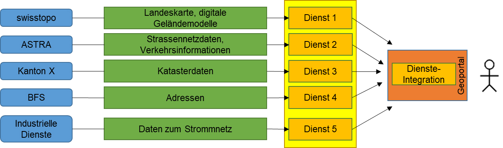
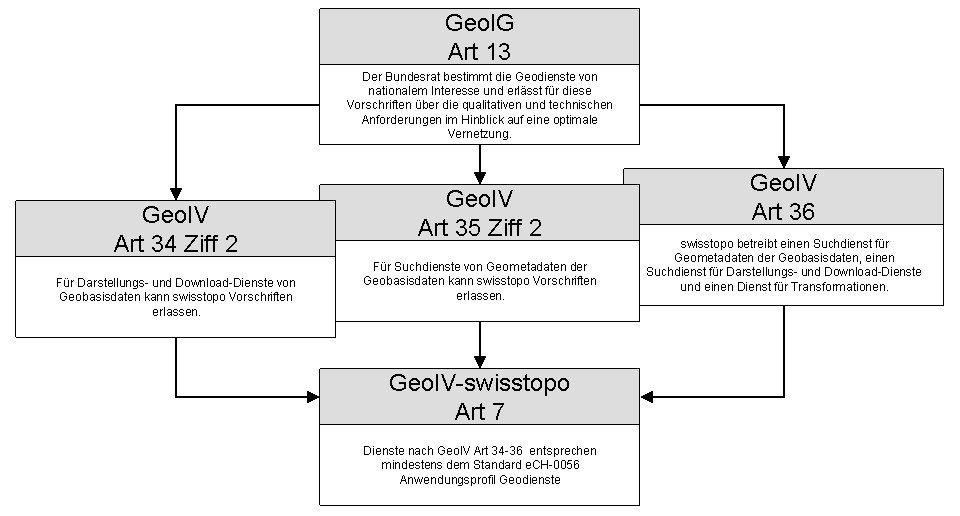

// Dokument settings
[.text-justify]
// Dokument Titel
= eCH-0056 - Anwendungsprofil Geodienste
:toc: macro
:toc-title: Inhaltsverzeichnis
:table-caption: Tabelle
:toclevels: 6
:pdf-theme: eCH
:pdf-themesdir: {docdir}
:sectlinks:
:!section-refsig:
:figure-caption: Abbildung

[width="100%",cols="29%,71%",]
|===
|Name |Anwendungsprofil Geodienste
|*eCH-Nummer* |eCH-0056
|*Kategorie* |Standard
|*Reifegrad* |
|*Version* |4.0 (Entwurf)
|*Status* |In Arbeit
|*Beschluss am* |JJJJ-MM-TT
|*Ausgabedatum* |JJJJ-MM-TT
|*Ersetzt Version* |eCH-0056 3.0
|*Voraussetzungen* |eCH-0056 3.0
|*Beilagen* |
|*Sprachen* |Deutsch (Original), Französisch (Übersetzung)
|*Autoren*  | eCH Fachgruppe Geoinformation
*Andere Teilnehmer*|
|*Herausgeber / Vertrieb*| Verein eCH, Mainaustrasse 30, Postfach, 8034 Zürich +
T 044 388 74 64, F 044 388 71 80 +
http://www.ech.ch[www.ech.ch] / mailto:info@ech.ch[info@ech.ch]
|===

// Seitenumbruch
<<<

[.section nonumber]
[#summary]
== Zusammenfassung

Um Geodaten entsprechend dem Geoinformationsgesetz (GeoIG) [1a] aktuell, rasch, einfach, in erforderlicher Qualität und zu angemessenen Preisen einer breiten Nutzerschaft zur Verfügung zu stellen, wird die Nationale Geodateninfrastruktur (NGDI) aufgebaut und betrieben. Geodiensten kommt dabei eine zentrale Bedeutung zu. Dank ihnen ist es möglich, die räumlich verteilten Daten über das Internet zur Verfügung zu stellen und zu nutzen. 

Damit die verschiedenen Geodienste als Bestandteile der NGDI funktionieren können, bedürfen existierende Spezifikationen aufgrund teilweise fehlender oder ungenügend genauer Definitionen und spezifisch Schweizerischer Anforderungen einer Profilierung. Zudem erfordert die Vernetzung abgestimmte Inhaltselemente und Metainformationen. 

Über den vorliegenden Standard wird die Implementierung von Geobasisdiensten mit weiterführenden Richtlinien und Empfehlungen definiert oder konkretisiert und so für den Einsatz in der Praxis tauglich gemacht. Die hier definierten Richtlinien sind aufgrund der Referenzierung des Standards in Art. 7 GeoIV-swisstopo [2a] eine verbindliche Rechtsnorm für die auf den Geobasisdaten des Bundesrechts aufbauenden Geodienste, respektive deren zuständigen Stellen. 

Grundlagen, Zielsetzungen und Abgrenzung des Anwendungsprofils werden in Kapitel xref:introduction[xrefstyle=full] diskutiert. Die eigentlichen Richtlinien und Empfehlungen, die mit einer Ausnahme (vgl. unten) Spezifikationen des Open Geospatial Consortium (OGC) konkretisieren, werden in den dedizierten Kapiteln formuliert

// Seitenumbruch
<<<

// Inhaltverzeichnis
toc::[]
:sectnums:

[.section nonumber]
== Hinweis

Aus Gründen der besseren Lesbarkeit und Verständlichkeit wird im vorliegenden Dokument bei der Bezeichnung von Personen ausschliesslich der maskulinen Form verwendet. Diese Formulierung schliesst Frauen in ihrer jeweiligen Funktion ausdrücklich mit ein.

// Seitenumbruch
<<<

[#introduction]
== Einleitung

[#status]
=== Status

Entwurf: Das Dokument wurde von den zuständigen Referenten aus dem Expertenausschuss zur öffentlichen Konsultation freigegeben und entsprechend publiziert.

// In Arbeit: Der Gebrauch ist nur innerhalb der Fachgruppe, bzw. im Expertenausschuss zugelassen.

// Entwurf: Das Dokument wurde von den zuständigen Referenten aus dem Expertenausschuss zur öffentlichen Konsultation freigegeben und entsprechend publiziert.

// Vorschlag: Das Dokument wird dem Expertenausschuss zur Genehmigung vorgelegt, ist aber normativ noch nicht gültig. 

// Genehmigt: Das Dokument wurde vom Expertenausschuss genehmigt. Es hat für das definierte Ein-satzgebiet im festgelegten Gültigkeitsbereich normative Kraft.

// Abgelöst: Das Dokument wurde durch eine neue, aktuellere Version ersetzt. Die Benutzung ist zwar noch möglich, es wird aber empfohlen, die neuere Version einzusetzen.

// Aufgehoben: Das Dokument wurde von eCH zurückgezogen. Er darf nicht mehr genutzt werden.

// Sistiert: Das Dokument wurde von eCH zurückgezogen. Es darf nicht genutzt werden. Es hat den Sta-tus «Genehmigt» nicht erreicht. 

[#context]
=== Ausgangslage und Motivation

Mit der Etablierung von Geowebdiensten (nachfolgend Geodienste genannt) werden die Vorausset-zungen für eine einfachere Nutzung von Geoinformation durch einen immer breiteren Nutzerkreis und für die Erschliessung neuer Anwendungsbereiche geschaffen. In der Schweiz wurde mit der Strategie Geoinformation Schweiz und dem Aktionsplan 2022+ [3a] die Basis für die Weiterentwicklung einer Nationalen Geodateninfrastruktur (NGDI) geschaffen. 

Das Geoinformationsgesetz (GeoIG) [1a], das am 1. Juli 2008 in Kraft getreten ist, und die darauf auf-bauende Geoinformationsverordnung (GeoIV) [4a] dienen heute als rechtliche Basis für die NGDI. 

Im Rahmen der Entwicklung der NGDI wird die Integration von Geodiensten angestrebt. Mögliche Bei-spiele für eine solche Vernetzung bzw. Zusammenführung von Geodiensten unterschiedlicher Anbieter sind in xref:fig:geoservices[xrefstyle=short] gegeben.
 
//Figure

[#fig:geoservices]
.Vernetzter Zugriff auf Geodaten mittels Geodiensten (modifiziert nach [28])

Bei der Umsetzung der Vernetzung und Integration von Geodiensten stellen sich neben den organisatorischen Herausforderungen auch Herausforderungen technischer Natur. Diesen Problemen wird mit Normung / Standardisierung (z.B. ISO/TC 211, Open Geospatial Consortium OGC) begegnet.

[#objectives]
=== Vernetzung von Geodiensten, Bedeutung der Datenharmonisierung

Hauptziel ist die möglichst reibungslose Vernetzung von Geodiensten in einem heterogenen, verteilten Netzwerk. Je nach Anforderung kann diese Vernetzung von der reinen Visualisierung, über die einheit-liche Informationsabfrage bis hin zur Datenabgabe nach harmonisierten Datenmodellen gehen. Im Rahmen der Umsetzung des GeoIG [1a] und der zugehörigen Verordnungen [2a][4a] steht die Daten-modellharmonisierung im Vordergrund. Die Harmonisierung von Datenmodellen und Daten betrifft die Aktionsfelder «Ökosystem Geoinformation fördern» und «Geodaten verknüpfen» gemäss dem Aktionsplan zur Strategie Geoinformation Schweiz.

Verschiedene Probleme verhindern oder erschweren heute die Vernetzung von Geodiensten verschie-dener Anbieter: 

* Unvollständige Unterstützung der Standards durch die eingesetzten Softwarekomponenten.
* Server und Client unterstützen nicht dieselbe Version des Standards.
* Ein Server unterstützt ein vom Client angefordertes Projektionssystem nicht.
* Ebenen, die geodienstübergreifend kombiniert werden könnten, sind in unterschiedlichen Massstabsbereichen sichtbar
* Geodienste sind nicht oder nur unzulänglich beschrieben.
* Geodienstbeschreibungen verschiedener Geodienste sind nicht aufeinander abgestimmt.
* Die Benennung der Ebenen ist uneinheitlich.
* Bei der Zusammenführung von Geodiensten angrenzender geografischer Gebiete sind die Grenzen nicht harmonisiert.

Zu beachten sind SOA-Strategien, z.B. vom ISB Bund [1].

[#purpose]
=== Anwendungsprofil Geodienste: Zielsetzung und Zielgruppe

Im Kontext der Umsetzung des GeoIG [1a] (vgl. Abschnitt xref:legal[xrefstyle=short]) definiert das «Anwendungsprofil Geodienste» rechtsverbindlich die Mindestanforderungen an die Geobasisdienste (vgl. Abschnitt xref:definitions[xrefstyle=short]).

Daneben wird mit den geeigneten Einschränkungen und Präzisierungen der ausgewählten Standards für Geodienste die Basis für die interoperable Nutzung gelegt. Das Anwendungsprofil ist so in jedem Fall standardkonform. Es soll im Rahmen der NGDI und darüber hinaus möglich sein, Geodienste unterschiedlicher Anbieter zu kombinieren und die Geodaten anbieterübergreifend verfügbar zu machen, um so die Interoperabilität in der Praxis zu gewährleisten.

Das vorliegende Dokument stellt eine verbindliche Vorgabe dar, welche für die Implementierung von Geobasisdiensten im Rahmen des GeoIG [1a] und innerhalb der Schweiz gilt. Die Abgrenzung anderen Nutzergruppen gegenüber manifestiert sich beispielsweise durch Einschränkungen von Wertebereichen bestimmter Parametern (z.B. Verwendung der in der Schweiz in der amtlichen Vermessung üblichen räumlichen Referenzsysteme).

Das Anwendungsprofil richtet sich an Anbieter und «Integratoren» von Geodiensten und soll diese auch bei der Auswahl und Umsetzung geeigneter Technologien unterstützen.

Berücksichtigt sind die zum Zeitpunkt der Überarbeitung dieses Dokuments als relevant erachteten Standards und Spezifikationen in ihren jeweilig genannten Versionen. Grundsätzlich wird im Anwendungsprofil eine konservative Haltung in Bezug auf bestehende Standard- und Spezifikationsversionen eingenommen. Es wird nicht primär die jüngste Version gefordert, sondern diejenige, die zum aktuellen Zeitpunkt als die am meisten in der Praxis etablierte erachtet wird.

[#definitions]
=== Begriffe und Definitionen

[width="100%",cols="23%,77%"]
|===
|Geobasisdaten |Als Geobasisdaten gemäss Art. 34 GeoIV [4a] werden jene Geodaten bezeichnet, die auf einem rechtsetzenden Erlass des Bundes, eines Kantons oder einer Gemeinde beruhen.
|Geobasisdienst |Unter Geobasisdiensten werden zusammenfassend die Geodienste für Geobasisdaten nach Art. 34 GeoIV [4a], die Dienste für Geometadaten nach Art. 35 GeoIV [4a] und die sachübergreifenden Geodienste nach Art. 36 GeoIV [4a] verstanden. Der Begriff beschränkt sich auf die in den Artikeln angesprochenen Geodienste. Im Wesentlichen handelt es sich dabei um Darstellungs-, Download- und Suchdienste. Es wird darauf hingewiesen, dass eCH-0056 keinen Anspruch auf Interpretation des Rechts legt, sondern die erwähnten Begriffe so präzisiert, wie sie im Rahmen des Standards zu verstehen sind.
|Darstellungsdienst a| Internetdienst, mit dem darstellbare Geodatensätze angezeigt, vergrössert, verkleinert und verschoben, Daten überlagert angezeigt werden können und der ein Navigieren in den Geodaten ermöglicht (Art. 2 GeoIV [4a]).

Im Rahmen von eCH-0056 wird unter einem Darstellungsdienst konkret ein Dienst gemäss OpenGIS Web Map Server Implementation Specification [2] (WMS) oder OpenGIS Web Map Tile Service Implementation Standard [3] (WMTS) oder OGC API - Tiles - Part 1: Core [4] verstanden.
|Download-Dienst a| Internetdienst, der das Herunterladen von Kopien vollständiger Geodatensätze oder von Teilen davon (vordefinierter Download-Dienst) und, wenn durchführbar, den direkten Zugriff darauf (Direktzugriffs-Downloaddienst) ermöglicht (Art. 2 GeoIV [4a]).

Im Rahmen von eCH-0056 werden unter einem Download-Dienst die folgenden Dienste verstanden:

* Ein vordefinierter Dienst für Raster- und Vektordaten auf Basis der STAC Spezifikation [5] und möglicherweise der STAC-API Spezifikation [6]. Im Sinne einer landesspezifischen Ergänzung wird als Transferformat für die modellkonforme Bereitstellung von Vektor-Geodaten INTERLIS-XTF gemäss Standard eCH-0031 Version 2.0 [7] oder INTERLIS-GML gemäss Standard eCH-0118 Version 2.0 [8] gefordert

* Ein Direktzugriffs-Downloaddienst gemäss OpenGIS Web Feature Service Interface Standard (WFS) [9] oder gemäss OGC API - Features - Part 1: Core [10] und OGC API - Features - Part 2: Coordinate Reference Systems
by Reference [11]
* Sowie für Rasterdaten ein Dienst gemäss OGC Web Coverage Service Interface Standard (WCS) [12].
|Suchdienst a| Internetdienst, mit dem nach Geodiensten und, auf der Grundlage entsprechender Geometadaten, nach Geodatensätzen gesucht werden kann (Art. 2 GeoIV [4a]).

Im Rahmen von eCH-0056 wird unter einem Suchdienst ein Katalogdienst gemäss OGC Catalogue Services 3.0 - General Model [13] und OGC Catalogue Services 3.0 Specification - HTTP Protocol Binding [14] verstanden.
|===

[#legal]
=== Rechtliche Aspekte

Durch das Inkrafttreten des GeoIG vom 1. Juli 2008 [1a] und der zugehörigen Verordnungen GeoIV [4a] wird der Standard eCH-0056 gemäss Art. 7 GeoIV-swisstopo [2a] zum verbindlichen Standard für Geobasisdienste.

//Figure

[#fig:legal_aspects]
.Rechtsgrundlagen der Verbindlichkeit von eCH-0056

Die Kompetenz von swisstopo eCH-0056 als verbindlichen Standard festzulegen beruht auf den Art. 34 -36 GeoIV [4a] (vgl. dazu xref:fig:legal_aspects[xrefstyle=short]).

Wenn eine zuständige Stelle (gemäss Anhang 1 GeoIV [4a]) einen oder mehrere Geobasisdatensätze in einem Geodienst anbietet und/oder vertreibt, muss dieser Dienst eCH-0056-konform sein, also sämtliche im Standard enthaltenen verbindlichen Vorgaben erfüllen. Es ist dabei unerheblich, ob die entsprechende zuständige Stelle mit einem Geodienst
ausschliesslich Geobasisdatensätze anbietet, die ihr gemäss Anhang 1 GeoIV [4a] zugeordnet sind oder auch solche anderer zuständiger Stellen.

Für Dritte (insbesondere Private) gelten diese Voraussetzungen grundsätzlich nicht. Wenn aber Dritte durch bestimmte Vereinbarungen oder Verfügungen die Pflichten als zuständige Stelle übertragen bekommen, so unterstehen sie diesbezüglich ebenfalls den geltenden gesetzlichen Bestimmungen und müssen die entsprechenden Geodienste eCH-0056-konform gestalten.

Allgemein ist zu beachten, dass die gesetzliche Verpflichtung den Standard einzuhalten nur die Richtlinien, d.h. die zwingenden Vorgaben umfasst. Die Empfehlungen sind nach Möglichkeit einzuhalten, jedoch besteht dazu keine gesetzliche Pflicht.

[#scope]
=== Abgrenzung

Im vorliegenden Anwendungsprofil werden basierend auf den referenzierten Normen die Geobasisdienste standardisiert. Dabei werden neben den landesspezifischen Anforderungen, Ansprüche zur Sicherstellung der Interoperabilität berücksichtigt.

Die Implementierung der verschiedenen Geodienste wird durch die referenzierten Implementierungsspezifikationen geregelt und nicht im vorliegenden Standard abgehandelt. Die folgenden Aspekte, welche ebenfalls wichtige Fragestellungen im Rahmen der Etablierung von Geodiensten ansprechen, werden vom «Anwendungsprofil Geodienste» nicht abgedeckt:

* Software-Design einzelner Geodienste
* Architektur von Geodienstlandschaften
* Geodienste als Produkt (z.B. Preismodelle, Marketing, betriebliche
Aspekte)

Im Allgemeinen sind etablierte Standards zu berücksichtigen. Dazu gehört insbesondere eCH-0014: SAGA.ch [15]. 

[#structure]
=== Aufbau des Anwendungsprofil

Die wesentlichen inhaltlichen Komponenten des Anwendungsprofils sind:

* Kapitel xref:introduction[xrefstyle=full]
* Kapitel xref:guidelines[xrefstyle=full]

Die Richtlinien und Empfehlungen werden für jede Geodienst-Spezifikation in einem eigenen Abschnitt nach einer einheitlichen Struktur abgehandelt. Diese umfasst die folgenden Elemente:

* Kurz-Beschreibung
* Aktuelle Version: Als aktuelle Version wird diejenige mit der höchsten Dokumentenstufe angesehen, im besten Fall die finale Version. Somit werden neben der eigentlichen Versionsnummer auch der Dokumenten-Status, sowie die zuständige Organisation, die diesen festlegt, angegeben. Ebenfalls aufgeführt ist das Erscheinungsdatum.
* Richtlinien: Sind pro Spezifikation und Anforderungsklasse. Die Richtlinien definieren zwingende Vorgaben (vgl. Abschnitt xref:conformance[xrefstyle=short]).
* Empfehlungen: Sind pro Spezifikation und Anforderungsklasse. Empfehlungen sind nicht zwingende Vorgaben (vgl. Abschnitt xref:conformance[xrefstyle=short]).

Das Anwendungsprofil legt in den Richtlinien fest, welche Version eines Standards unterstützt werden muss.

[#update]
=== Nachführung

Die Nachführung dieses Dokumentes erfolgt periodisch, wobei zwischen grösseren Überarbeitungen (z.B. Änderung einer Richtlinie, Einführung neuer Standards) und kleinen Änderungen und Ergänzungen unterschieden wird. Folgende Nachführungsperioden sind festgelegt:

* Überarbeitungen grösseren Umfangs > 2 Jahre
* Kleinere Änderungen < 2 Jahre

Change-Requests können direkt an die geostandards.ch-Geschäftsstelle gerichtet. Der detaillierte Ablauf ist im Standard eCH-0150 «Change und Release Management von eCH-Standards» [5a] geregelt.

[#conformance]
=== Konformität

Um Unklarheiten in der Terminologie zu vermeiden, werden an dieser Stelle Ausdrücke definiert, die in den Richtlinien und Empfehlungen zum Einsatz kommen.

[width="100%",cols="19%,81%",options="noheader",]
|===
|Richtlinie| Eine Richtlinie ist eine zwingende Vorgabe, welche eingehalten werden muss, um zum Anwendungsprofil konform zu sein. Insbesondere wird durch die Umsetzung der Richtlinien der Rechtsvorgabe im Zusammenhang mit Art.7 GeoIV-swisstopo [2a] entsprochen.

Richtlinien sind in Kapitel xref:guidelines[xrefstyle=short] durch das Schlüsselwort "*MUSS*" ausgezeichnet.

|Empfehlung| Eine Empfehlung ist eine nicht zwingende Vorgabe. Sie sollte für eine verbesserte Interoperabilität, wenn möglich eingehalten werden, hat aber hinsichtlich der Konformität zum Anwendungsprofil keine Wirkung.

Empfehlungen sind in Kapitel xref:guidelines[xrefstyle=short] durch das Schlüsselwort "*SOLLTE*".
Richtlinien und Empfehlungen werden in Anforderungsklassen verknüpft.
|===

Die Definition der Begriffe "*MUSS*" und "*SOLLTE*" lehnt sich an eCH-0003 [6a] an. Die Ausdrücke werden im Text fett gesetzt und durch GROSSSCHREIBUNG ausgezeichnet.
Die Definition der Anforderungsklassen basiert auf dem Dokument: "The Specification Model - A Standard for Modular specifications" [25].

Für jede Anforderungsklasse wird ein eindeutiger URI definiert, der es ermöglicht, im Anwendungsprofil auf die Anforderungsklasse zu verweisen. Die Syntax für den URI lautet: https://ech.ch/fr/0056/main/base/req/{Anforderungsklasse}. Die Anforderungsklasse "http" wird z. B. durch den URI https://ech.ch/fr/0056/main/base/req/http definiert.
Um den Anschluss an die älteren Versionen des eCH-0056-Standards zu behalten, wurden die alten Referenzen der Anforderungen und Empfehlungen (z.B. `WMS-01`) an die neue Nomenklatur angehängt.

[width="100%",cols="19%,81%",options="noheader",]
|===
|*MUSS* |Dieser Ausdruck bedeutet, dass die Richtlinie in jedem Fall
erfüllt sein muss.
|*SOLLTE* |Dieser Ausdruck bedeutet, dass unter Umständen gute Gründe existieren, diese Richtlinie nicht umzusetzen. Es müssen jedoch sämtliche Auswirkungen verstanden und sorgfältig abgewogen werden, bevor ein anderer Weg eingeschlagen wird.
|===

[#guidelines]
== Richtlinien und Empfehlungen
[#general_rules]
=== Allgemeine Regeln
[#http]
==== Antwort auf HTTP(s)-Abfragen

[width="100%",cols="41%,59%",options="noheader",]
|===
|*Anforderungsklasse* |https://ech.ch/fr/0056/main/base/req/http
|Zieltyp |Encoding
|Abhängigkeiten |N/A
|===

[width="100%",cols="41%,59%",options="noheader",]
|===
|*Richtlinie 1* |/req/http/response
| A| Ein Server *MUSS* ein Dokument zurücksenden, das mit dem angeforderten Medientyp übereinstimmt.
| B| Ein Server *MUSS* ein Dokument zurückgeben, das der UTF-8-Zeichenkodierung einhält.
|===

[#date-time]
==== Angabe von Datum und Zeit

[width="100%",cols="41%,59%",options="noheader",]
|===
|*Anforderungsklasse* |https://ech.ch/fr/0056/main/base/req/datetime
|Zieltyp |Encoding
|ISO 8601-1:2019 Datum und Uhrzeit - Darstellungen für den Informationsaustausch - Teil 1: Grundlegende Regeln.
|===

[width="100%",cols="41%,59%",options="noheader",]
|===
|*Richtlinie 1* |/req/datetime/format
|A| Die Angabe von Datum und Zeit *MUSS* der Norm "ISO" 8601-1:2019" [10]entsprechen. +

Format Beispiel +

YYYY "2023" +
YYYY-MM "2023-08" + +
YYYY-MM-DD "2023-08-31" + +
YYYY-MM-DDThh "2023-08-31T16" +
YYYY-MM-DDThh:mm "2023-08-31T16:55" +
YYYY-MM-DDThh:mm:ss "2023-08-31T16:55:01" +

Eine Ausnahme bilden nur Datums- und Zeitangaben in Vermerken, die ausschliesslich von Menschen lesbar sein müssen.
|===

[#language]
=== Sprache

[width="100%",cols="24%,76%",options="noheader",]
|===
|*Anforderungsklasse* |https://ech.ch/fr/0056/main/base/req/lang
|Zieltyp |Web API
| Abhängigkeiten |https://portal.ogc.org/files/?artifact_id=14416[OGC Web Services Common Standard 2.0.0] +
https://docs.ogc.org/is/19-072/19-072.html#_98ff4350-10c4-454e-b5da-6802f1ad70d7[OGC API - Common - Part 1: Core (1.0.0) Core Requirements Class] 
|===

[width="100%",cols="24%,76%",options="noheader",]
|===
|*Richtlinie 1* |/req/string-i18n
|A (LANG-01) |Sofern nicht in einem spezifischen Standard definiert, *MUSS* für die Sprach-Verhandlung der übliche HTTP-Content-Negotiation-Mechanismus [18] angewendet werden.
|B (LANG-02) |Sprach-Tags *MÜSSEN* nach «RFC 5646» [19] erfolgen.
|C (LANG-03) |String-Werte, die sprachlichen Text enthalten, *MÜSSEN* der Sprache entsprechen, die der Server zurückgibt.
|D (LANG-04) |Zusätzlich zur Anforderung *1 A* MUSS ein Server einen Anfrageparameter `AcceptLanguages` (OWS-Dienste) oder `lang` (OGC API) unterstützen.
|E (LANG-05) |Bei Link-Objekten *SOLLTE* das Attribut `xml:lang` (OWS-Dienste) oder `hreflang`(OGC API) verwendet werden, um die Sprache der referenzierten Ressource anzugeben [24].
|===

[#metadata]
=== Metadaten

[width="100%",cols="24%,76%",options="noheader",]
|===
|*Anforderungsklasse* |https://ech.ch/fr/0056/main/base/req/metadata
|Zieltyp |Web API
|Abhängigkeiten |https://portal.ogc.org/files/?artifact_id=14416[OGC Web Services Common Standard 2.0.0] +
https://docs.ogc.org/is/19-072/19-072.html[OGC API - Common - Part 1: Core (1.0.0) Core Requirements Class] 
|===

[width="100%",cols="24%,76%",options="noheader",]
|===
|*Richtlinie 1* |/req/metadata
|A (META-01) |Ein Geodienst MUSS im nationalen Geometadatenkatalog beschrieben werden.
|B (META-02) |Sofern ein bestimmter Standard es zulässt, *MUSS* ein Geodienst einen Link auf die Dienstmetadaten im nationalen Geometadatenkatalog angeben.
|C (META-03) |Die vom Geodienst selbst bereitgestellte Dienstbeschreibung *MUSS* mit der entsprechenden Beschreibung im nationalen Geometadatenkatalog übereinstimmen.
|D (META-04) |Sofern ein bestimmter Standard es zulässt, *MUSS* ein Geodienst für jeden Geodatenbestand (z.B.: «Layer» beim WMS und WMTS, «Feature Type» beim WFS, «Coverage» beim WCS, «Collection» bei OGC APIs und STAC) einen Link auf die Datenmetadaten angeben.
|E (META-05) |Die Beschreibung der Geodatenbestände, die vom Geodienst selbst bereitgestellt wird, *MUSS* mit der entsprechenden Beschreibung im nationalen Geometadatenkatalog übereinstimmen.
|F (META-06) |Sofern ein bestimmter Standard es zulässt, *MUSS* ein Geodienst Kontaktinformationen über den Dienstanbieter und über die Attribution der bereitgestellten Geodatenbestände angeben.
|===

[width="100%",cols="24%,76%",options="noheader",]
|===
|*Empfehlung 1* |/rec/metadata
|META-07 |Sofern ein bestimmter Standard es zulässt, *SOLLTE* ein Geodienst für jeden Geodatenbestand einen Link auf die Daten angeben.
|===

Spezifische Richtlinien und Empfehlungen zu den Geometadaten folgen in den Abschnitten zu den einzelnen Geodiensten.

[#crs]
=== Koordinatensysteme

Das IOGP Geomatics Committee katalogisiert weltweit Koordinatensysteme und vergibt jeweils eindeutige Identifikationsnummern (die so genannten «EPSG-Codes»). Die EPSG-Datenbank [7a] dient als Standard für das Referenzieren von Koordinatenreferenzsystemen und Transformationen.

In der Schweiz ist der Bezugsrahmen CH1903+/LV95, der dem Code EPSG:2056 entspricht.

[width="100%",cols="24%,76%",options="noheader",]
|===
|*Classe d'exigences* |https://ech.ch/fr/0056/main/base/req/crs
|Type d'objectif |Web API
|Dépendances |https://portal.ogc.org/files/?artifact_id=14416[OGC Web Services Common Standard 2.0.0] +
http://www.opengis.net/doc/IS/ogcapi-features-1/1.0[OGC API - Features - Part 1: Core 1.0] + 
https://docs.ogc.org/is/18-058r1/18-058r1.html#_requirements_class_coordinate_reference_systems_by_reference[OGC API - Features - Part 2: Coordinate Reference Systems by Reference] 
|===

[width="100%",cols="24%,76%",options="noheader",]
|===
|*Richtlinie 1* |/req/crs
|A (CRS-01) |Ein Geodienst *MUSS* das Schweizer Bezugssystem CH1903+ («EPSG:2056», Bezugsrahmen LV95) unterstützen.
|B (CRS-02) |Ein Geodienst *SOLLTE* das globale Koordinatenreferenzsysteme WGS84 in geografischen Koordinaten mit Pseudo-Platte-Carrée-Projektion («EPSG:4326») und Pseudo-Mercator Projektion («EPSG:3857») sowie das europäische Koordinatenreferenzsystem ETRS89 in geografischen Koordinaten («EPSG:4258») unterstützen.
|===

[width="100%",cols="24%,76%",options="noheader",]
|===
|*Empfehlung 1* |/rec/crs
|A (CRS-03) |Ein Geodienst *SOLLTE* die Koordinatenreferenzsysteme ETRS89 LAEA Europe («EPSG: 3035»), LCC Europe («EPSG: 3034») und UTM Zone 32N («EPSG: 3044») unterstützen.
|===

[#tilematrixset]
=== Schweizer CH1903+ Tile Matrix Set

[width="100%",cols="24%,76%",options="noheader",]
|===
|*Anforderungsklasse* |https://ech.ch/fr/0056/main/base/req/tms
|Objektivtyp |Web API
|Abhängigkeiten | 
https://docs.ogc.org/is/17-083r4/17-083r4.html#toc48[OGC Two Dimensional Tile Matrix Set and Tile Set Metadata] 
|===

[width="100%",cols="24%,76%",options="noheader",]
|===
|*Directive 1* |/req/tms
|A (TMS-01) | Die zur Umsetzung eines 2D-Tiledienstes vordefinierten Zoomstufen MÜSSEN für das Bezugssystem CH1903+ die folgenden Werte umfassen : +
1 Pixel entspricht 4000, 2000, 1000, 500, 250, 100, 50, 20, 10, 5, 2.5, 1, 0.5, 0.25, 0.1, 0.05 Meter. +
Sofern nicht in einem spezifischen Standard definiert, gilt für die Pixelgrösse der Standard «OGC Two Dimensional Tile Matrix Set» [21].
|===

[width="100%",cols="24%,76%",options="noheader",]
|===
|*Empfehlung 1* |/rec/tms
|A | Bei jeder Definition einer TileMatrixSet *SOLLTE* der folgende Ursprungspunkt verwendet werden: `2419995.75, 1350004.29`.
|B  |Ein Geodienst *SOLLTE* die untenstehende Definition der Schweizer CH1903+ Tile Matrix Set verwenden. 
|===

:table-Swiss2DTMS: 
.Definition des Schweizer TileMatrixSet CH1903+ / LV95
[cols="a,a,a,a,a"]
|===
5+| *CRS*: http://www.opengis.net/def/crs/EPSG/0/2056, CH1903+ / LV95

*BBOX LowerLeft:* 2419995.75, 1030006.66

*BBOX UpperRight:* 2900009.73, 1350004.29

*PointOfOrigin*: 2419995.75, 1350004.29

*TileWidth*: 256

*TileHeight*: 256
| *TileMatrix id* | *Scale Denominator* | *Cell Size (m)* | *Matrix Width* | *Matrix Height*
| 0 | 14285714.285714284 | 4000 | 1   | 1
| 1 | 7142857.142857142  | 2000 | 1   | 1
| 2 | 3571428.571428571  | 1000 | 2   | 2
| 3 | 1785714.2857142854 | 500  | 4   | 3
| 4 | 892857.1428571427  | 250  | 8   | 5
| 5 | 357142.8571428571  | 100  | 19  | 3
| 6 | 178571.42857142855 | 50   | 38  | 25
| 7 | 71428.57142857142  | 20   | 94  | 63
| 8 | 35714.28571428571  | 10   | 188 | 125
| 9 | 17857.142857142855 | 5    | 375 | 250
| 10 | 8928.571428571428 | 2.5  | 750 | 500
| 11 | 3571.428571428571 | 1    | 1875 | 1250
| 12 | 1785.7142857142856 | 0.5 | 3750 | 2500
| 13 | 892.8571428571428 | 0.25 | 7500 | 5000
| 14 | 357.14285714285717 | 0.1 | 18750 | 12500
| 15 | 178.57142857142858 | 0.05 | 37500 | 25000
|===

Um die Implementierung zu erleichtern, sind 2 Beispiele für die Kodierung (`XML` und `JSON`) der Definition des Schweizer TileMatrixSet CH1903+ / LV95 im Anhang xref:appendix-g[xrefstyle=full] zu finden.

[#visualization]
=== Darstellungsdiente

Ein Darstellungsdienst ist ein Internetdienst, mit dem darstellbare Geodatensätze angezeigt, vergrössert, verkleinert und verschoben, Daten überlagert angezeigt werden können und der ein Navigieren in den Geodaten ermöglicht (Art. 2 GeoIV [4a]).

Im Rahmen von eCH-0056 wird unter einem Darstellungsdienst konkret ein Dienst gemäss OpenGIS Web Map Server Implementation Specification [2] (WMS) oder OpenGIS Web Map Tile Service Implementation Standard [3] (WMTS) oder OGC API - Tiles - Part 1: Core [4] verstanden.

include::docs/visualization-services/wms-ech-0056-visualization-de.adoc[]
include::docs/visualization-services/wmts-ech-0056-visualization-de.adoc[]
include::docs/visualization-services/oatiles-ech-0056-visualization-de.adoc[]

[#download]
=== Download-Dienste

Ein Downloaddienst ist ein Internetdienst, der das Herunterladen von Kopien vollständiger Geodatensätze oder von Teilen davon (*vordefinierter Download-Dienst*) und, wenn durchführbar, den direkten Zugriff darauf (*Direktzugriffs-Downloaddienst*) ermöglicht (Art. 2 GeoIV [4a]).

Im Rahmen von eCH-0056 werden unter einem Download-Dienst die folgenden Dienste verstanden:

* Ein *vordefinierter*, *dateibasierter* Dienst für Raster- und Vektordaten auf Basis der STAC Spezifikation [5] und möglicherweise der STAC-API Spezifikation [6]. Im Sinne einer landesspezifischen Ergänzung wird als Transferformat für die modellkonforme Bereitstellung von Vektor-Geodaten INTERLIS-XTF gemäss Standard eCH-0031 Version 2.0 [7] oder INTERLIS-GML gemäss Standard eCH-0118 Version 2.0 [8] gefordert
* Ein *Direktzugriffs-Downloaddienst* gemäss OpenGIS Web Feature Service Interface Standard (WFS) [9] oder gemäss OGC API - Features - Part 1: Core [10] und OGC API - Features - Part 2: Coordinate Reference Systems by Reference [11]
* Sowie für Rasterdaten ein Dienst gemäss OGC Web Coverage Service Interface Standard (WCS) [12].

include::./docs/download-services/stac-ech-0056-download-de.adoc[]
include::./docs/download-services/wfs-ech-0056-download-de.adoc[]
include::./docs/download-services/oafeat-ech-0056-download-de.adoc[]
include::./docs/download-services/wcs-ech-0056-download-de.adoc[]

[#search]
=== Suchdienst

include::./docs/search-services/csw-ech-0056-search-de.adoc[]

[#other]
=== Andere Dienste

include::./docs/other-services/adr-0056-other-de.adoc[]

[#responsibility]
== Haftungsausschluss/Hinweise auf Rechte Dritter

*eCH*-Standards, welche der Verein *eCH* den Benutzenden zur unentgeltlichen Nutzung zur Verfügung stellen oder welche *eCH* referenzieren, haben nur den Status von Empfehlungen. Der Verein *eCH* haftet in keinem Fall für Entscheidungen oder Massnahmen, welche den Benutzenden auf Grund dieser Dokumente trifft und / oder ergreift. Die Benutzenden sind verpflichtet, die Dokumente vor deren Nutzung selbst zu überprüfen und sich gegebenenfalls beraten zu lassen. *eCH*-Standards können und sollen die technische, organisatorische oder juristische Beratung im konkreten Einzelfall nicht ersetzen.

In *eCH*-Standards referenzierte Dokumente, Verfahren, Methoden, Produkte und Standards sind unter Umständen markenrechtlich, urheberrechtlich oder patentrechtlich geschützt. Es liegt in der ausschliesslichen Verantwortlichkeit der Benutzenden, sich die allenfalls erforderlichen Rechte bei den jeweils berechtigten Personen und/oder Organisationen zu beschaffen.

Obwohl der Verein *eCH* all seine Sorgfalt darauf verwendet, die *eCH*-Standards sorgfältig auszuarbeiten, kann keine Zusicherung oder Garantie auf Aktualität, Vollständigkeit, Richtigkeit bzw. Fehlerfreiheit der zur Verfügung gestellten Informationen und Dokumente gegeben werden. Der Inhalt von *eCH*-Standards kann jederzeit und ohne Ankündigung geändert werden.

Jede Haftung für Schäden, welche den Benutzenden aus dem Gebrauch der *eCH*-Standards entstehen ist, soweit gesetzlich zulässig, wegbedungen.

[#copyright]
== Urheberrechte

Wer *eCH*-Standards erarbeitet, behält das geistige Eigentum an diesen. Allerdings verpflichtet sich die Erarbeitenden, ihr betreffendes geistiges Eigentum oder ihre Rechte an geistigem Eigentum anderer, sofern möglich, den jeweiligen Fachgruppen und dem Verein *eCH* kostenlos zur uneingeschränkten Nutzung und Weiterentwicklung im Rahmen des Vereinszweckes zur Verfügung zu stellen.

Die von den Fachgruppen erarbeiteten Standards können unter Nennung der jeweiligen Urheber von *eCH* unentgeltlich und uneingeschränkt genutzt, weiterverbreitet und weiterentwickelt werden.

*eCH*-Standards sind vollständig dokumentiert und frei von lizenz- und/oder patentrechtlichen Einschränkungen. Die dazugehörige Dokumentation kann unentgeltlich bezogen werden.

Diese Bestimmungen gelten ausschliesslich für die von *eCH* erarbeiteten Standards, nicht jedoch für Standards oder Produkte Dritter, auf welche in den *eCH*-Standards Bezug genommen wird. Die Standards enthalten die entsprechenden Hinweise auf die Rechte Dritter.

// Anhang A –  Normative Referenzen und Bibliographie

[#appendix-a]
[.appendix nonumber]
== Anhang A – Normative Referenzen und Bibliographie

include::./docs/appendices/appendix-a-de.adoc[]

// Anhang B – Mitarbeit und Überprüfung

[#appendix-b]
[.appendix nonumber]
== Anhang B – Mitarbeit & Überprüfung

include::./docs/appendices/appendix-b-de.adoc[]

// Anhang C – Abkürzungen und Glossar

[#appendix-c]
[.appendix nonumber]
== Anhang C – Abkürzungen und Glossar

include::./docs/appendices/appendix-c-de.adoc[]

[#appendix-d]
[.appendix nonumber]
== Anhang D – Änderungen gegenüber Vorversion

include::./docs/appendices/appendix-d-de.adoc[]

[#appendix-e]
[.appendix nonumber]
== Anhang E – Abbildungsverzeichnis

* xref:fig:geoservices[xrefstyle=full]
* xref:fig:legal_aspects[xrefstyle=full]

// Anhang F – Neue Trends bei den Geostandards

[#appendix-f]
[.appendix nonumber]
== Anhang F – Neue Trends bei den Geostandards

include::./docs/appendices/appendix-f-de.adoc[]

// Anhang G - Kodierungsbeispiele für die Definition des Schweizer TileMatrixSet CH1903+ / LV95.

[#appendix-g]
[.appendix nonumber]
== Anhang G - Kodierungsbeispiele für die Definition des Schweizer TileMatrixSet CH1903+ / LV95.

include::./docs/appendices/appendix-g-de.adoc[]