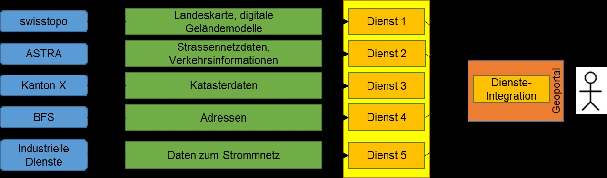

// Document settings
[.text-justify]
// Document title
= eCH-0056 - Anwendungsprofil Geodienste
// Table of contents
:toc: left
:toc-title: Inhaltsverzeichnis
:toclevels: 5
:sectnums:

// Figures
:figure-caption: Abbildung

[.section nonumber]
== Zusammenfassung

Um Geodaten entsprechend dem Geoinformationsgesetz (GeoIG) [1a] aktuell, rasch, einfach, in erforderlicher Qualität und zu angemessenen Preisen einer breiten Nutzerschaft zur Verfügung zu stellen, wird die Nationale Geodateninfrastruktur (NGDI) aufgebaut und betrieben. Geodiensten kommt dabei eine zentrale Bedeutung zu. Dank ihnen ist es möglich, die räumlich verteilten Daten über das Internet zur Verfügung zu stellen und zu nutzen. 
Damit die verschiedenen Geodienste als Bestandteile der NGDI funktionieren können, bedürfen existierende Spezifikationen aufgrund teilweise fehlender oder ungenügend genauer Definitionen und spezifisch Schweizerischer Anforderungen einer Profilierung. Zudem erfordert die Vernetzung abgestimmte Inhaltselemente und Metainformationen. 
Über den vorliegenden Standard wird die Implementierung von Geobasisdiensten mit weiterführenden Richtlinien und Empfehlungen definiert oder konkretisiert und so für den Einsatz in der Praxis tauglich gemacht. Die hier definierten Richtlinien sind aufgrund der Referenzierung des Standards in Art. 7 GeoIV-swisstopo [2a] eine verbindliche Rechtsnorm für die auf den Geobasisdaten des Bundesrechts aufbauenden Geodienste, respektive deren zuständigen Stellen. 
Grundlagen, Zielsetzungen und Abgrenzung des Anwendungsprofils werden in Kapitel 1 diskutiert. Die eigentlichen Richtlinien und Empfehlungen, die mit einer Ausnahme (vgl. unten) Spezifikationen des Open Geospatial Consortium (OGC) konkretisieren, werden in den dedizierten Kapiteln formuliert

[NOTE]
====
Kapitelverweise überarbeiten und Links einführen
====

[.section nonumber]
== Hinweis

Aus Gründen der besseren Lesbarkeit und Verständlichkeit wird im vorliegenden Dokument bei der Bezeichnung von Personen ausschliesslich die maskuline Form verwendet. Diese Formulierung schliesst Frauen in ihrer jeweiligen Funktion ausdrücklich mit ein. 

== Einleitung
=== Ausgangslage und Motivation

Mit der Etablierung von Geowebdiensten (nachfolgend Geodienste genannt) werden die Voraussetzungen für eine einfachere Nutzung von Geoinformation durch einen immer breiteren Nutzerkreis und für die Erschliessung neuer Anwendungsbereiche geschaffen. In der Schweiz wurde mit der Strategie Geoinformation Schweiz und dem Aktionsplan 2022+ [3a] die Basis für den Aufbau einer Nationalen Geodateninfrastruktur (NGDI) geschaffen. 
Das Geoinformationsgesetz (GeoIG) [1a], das am 1. Juli 2008 in Kraft getreten ist, und die darauf aufbauende Geoinformationsverordnung (GeoIV) [4a] dienen heute als rechtliche Basis für die NGDI. 
Im Rahmen der Entwicklung der NGDI wird die Integration von Geodiensten angestrebt. Mögliche Beispiele für eine solche Vernetzung bzw. Zusammenführung von Geodiensten unterschiedlicher Anbieter sind in Abbildung 1 gegeben. 

//Figure

.Vernetzter Zugriff auf Geodaten mittels Geodiensten (modifiziert nach [28])

[NOTE]
====
Abbildung bearbeitet
====

Bei der Umsetzung der Vernetzung und Integration von Geodiensten stellen sich neben den organisatorischen Herausforderungen auch Herausforderungen technischer Natur. Diesen Problemen wir mit Normung (z.B. ISO/TC 211) und Standardisierung (z.B. Open Geospatial Consortium OGC) begegnet.

=== Vernetzung von Geodiensten, Bedeutung der Datenharmonisierung

Hauptziel ist die möglichst reibungslose Vernetzung von Geodiensten in einem heterogenen, verteilten Netzwerk. Je nach Anforderung kann diese Vernetzung von der reinen Visualisierung, über die einheitliche Informationsabfrage bis hin zur Datenabgabe nach harmonisierten Datenmodellen gehen. Im Rahmen der Umsetzung des GeoIG [1a] und der zugehörigen Verordnungen [2a][4a] steht die Datenmodellharmonisierung im Vordergrund. Die Harmonisierung von Datenmodellen und Daten betrifft die Aktionsfelder «Ökosystem Geoinformation fördern» und «Geodaten verknüpfen» gemäss dem Aktionsplan zur Strategie Geoinformation Schweiz.
Verschiedene Probleme verhindern oder erschweren heute die Vernetzung von Geodiensten verschiedener Anbieter: 

* Unvollständige Unterstützung der Standards durch die eingesetzten Softwarekomponenten. 
* Server und Client unterstützen nicht dieselbe Version des Standards. 
* Ein Server unterstützt ein vom Client angefordertes Projektionssystem nicht. 
* Ebenen, die geodienstübergreifend kombiniert werden könnten, sind in unterschiedlichen Massstabsbereichen sichtbar 
* Geodienste sind nicht oder nur unzulänglich beschrieben. 
* Geodienstbeschreibungen verschiedener Geodienste sind nicht aufeinander abgestimmt. 
* Die Benennung der Ebenen ist uneinheitlich. 
* Bei der Zusammenführung von Geodiensten angrenzender geografischer Gebiete sind die Grenzen nicht harmonisiert. 
* Thematische Auswertungen beziehungsweise Aufbereitungen, wie beispielsweise ein Zonenplan, sind über die administrativen Grenzen hinweg nicht harmonisiert.

Geodienst-Anbieter müssen dafür sorgen, dass für jeden Geodienst eine standardbasierte Geodienstbeschreibung unter Einhaltung der SOA-Policies des Bundes [1] gewährleistet wird.

=== Anwendungsprofil Geodienste: Zielsetzung und Zielgruppe

Im Kontext der Umsetzung des GeoIG [1a] definiert das «Anwendungsprofil Geodienste» rechtsverbindlich die Mindestanforderungen an die Geobasisdienste (vgl. Kapitel 3.4). 
Daneben wird mit den geeigneten Einschränkungen und Präzisierungen der ausgewählten Standards für Geodienste die Basis für die interoperable Nutzung gelegt. Das Anwendungsprofil ist so in jedem Fall standardkonform. Es soll im Rahmen der NGDI und darüber hinaus möglich sein, Geodienste unterschiedlicher Anbieter zu kombinieren und die Geodaten anbieterübergreifend verfügbar zu machen, um so die Interoperabilität in der Praxis zu gewährleisten. 
Das vorliegende Dokument stellt eine verbindliche Vorgabe dar, welche für die Implementierung von Geobasisdiensten im Rahmen des GeoIG [1a] und innerhalb der Schweiz gilt. Die Abgrenzung anderen Nutzergruppen gegenüber manifestiert sich beispielsweise durch Einschränkungen von Wertebereichen bestimmter Parametern (z.B. Verwendung der in der Schweiz in der amtlichen Vermessung üblichen räumlichen Referenzsysteme). 
Das Anwendungsprofil richtet sich an Anbieter und «Integratoren» von Geodiensten und soll diese auch bei der Auswahl und Umsetzung geeigneter Technologien unterstützen. 
Berücksichtigt sind die zum Zeitpunkt der Überarbeitung dieses Dokuments als relevant erachteten Standards und Spezifikationen in ihren jeweilig genannten Versionen. Grundsätzlich wird im Anwendungsprofil eine konservative Haltung in Bezug auf bestehende Standards und Spezifikationen eingenommen. Es wird nicht primär die jüngste Version gefordert, sondern diejenige, die zum aktuellen Zeitpunkt als die am meisten in der Praxis etablierte erachtet wird. 

=== Begriffe und Definitionen

[width="100%",cols="35%,65%",options="header",]
|===
|Geobasisdaten |Als Geobasisdaten gemäss Art. 34 GeoIV [4a] werden jene
Geodaten bezeichnet, die auf einem rechtsetzenden Erlass des Bundes,
eines Kantons oder einer Gemeinde beruhen.
|Geobasisdienst |Unter Geobasisdiensten werden zusammenfassend die
Geodienste für Geobasisdaten nach Art. 34 GeoIV [4a], die Dienste für
Geometadaten nach Art. 35 GeoIV [4a] und die sachübergreifenden
Geodienste nach Art. 36 GeoIV [4a] verstanden. Der Begriff beschränkt
sich auf die in den Artikeln angesprochenen Geodienste. Im Wesentlichen
handelt es sich dabei um Darstellungs-, Download-, Such- und
Transformationsdienste. Es wird darauf hingewiesen, dass eCH-0056 keinen
Anspruch auf Interpretation des Rechts legt, sondern die erwähnten
Begriffe so präzisiert, wie sie im Rahmen des Standards zu verstehen
sind.
|Darstellungsdienst |
Internetdienst, mit dem darstellbare Geodatensätze angezeigt,
vergrössert, verkleinert und verschoben, Daten überlagert angezeigt
werden können und der ein Navigieren in den Geodaten ermöglicht (Art. 2
GeoIV [4a]).
Im Rahmen von eCH-0056 wird unter einem Darstellungsdienst konkret ein
Dienst gemäss OpenGIS Web Map Server Implementation Specification [2]
(WMS) oder OpenGIS Web Map Tile Service Implementation Standard [3]
(WMTS) oder OGC API - Tiles - Part 1: Core [4] oder Styled Layer
Descriptor [22] oder Symbology Encoding [23] (SE) verstanden.
|Download-Dienst |
Internetdienst, der das Herunterladen von Kopien vollständiger
Geodatensätze oder von Teilen davon (vordefinierter Download-Dienst)
und, wenn durchführbar, den direkten Zugriff darauf
(Direktzugriffs-Downloaddienst) ermöglicht (Art. 2 GeoIV [4a]).
Im Rahmen von eCH-0056 werden unter einem Download-Dienst die folgenden
Dienste verstanden:
* Ein vordefinierter Dienst für Raster- und Vektordaten auf Basis der STAC
Spezifikation [5] und möglicherweise der STAC-API Spezifikation [6]. Im
Sinne einer landesspezifischen Ergänzung wird als Transferformat für die
modellkonforme Bereitstellung von Vektor-Geodaten INTERLIS-XTF gemäss
Standard eCH-0031 Version 2.0 [7] oder INTERLIS-GML gemäss Standard
eCH-0118 Version 2.0 [8] gefordert
* Ein Direktzugriffs-Downloaddienst gemäss OpenGIS Web Feature Service
Interface Standard (WFS) [9] oder gemäss OGC API - Features - Part 1:
Core [10] und OGC API - Features - Part 2: Coordinate Reference Systems
by Reference [11]
* Sowie für Rasterdaten ein Dienst gemäss OGC Web Coverage Service
Interface Standard (WCS) [12].
|Suchdienst |
Internetdienst, mit dem nach Geodiensten und, auf der Grundlage
entsprechender Geometadaten, nach Geodatensätzen gesucht werden kann
(Art. 2 GeoIV [4a]).
Im Rahmen von eCH-0056 wird unter einem Suchdienst ein Katalogdienst
gemäss OGC Catalogue Services 3.0 - General Model [13] und OGC
Catalogue Services 3.0 Specification - HTTP Protocol Binding [14]
verstanden.
|===

=== Rechtliche Aspekte

Durch das Inkrafttreten des GeoIG vom 1. Juli 2008 [1a] und der zugehörigen Verordnungen GeoIV [4a] wird der Standard eCH-0056 gemäss Art. 7 GeoIV-swisstopo [2a] zum verbindlichen Standard für Geobasisdienste.

//Figure

.Rechtsgrundlagen der Verbindlichkeit von eCH-0056
image::images/legal_aspects_de.jpg[align="center"]

Die Kompetenz von swisstopo eCH-0056 als verbindlichen Standard festzulegen beruht auf den Art. 34 -36 GeoIV [4a] (vgl. dazu Abbildung 2). 
Wenn eine zuständige Stelle (gemäss Anhang 1 GeoIV [4a]) einen oder mehrere Geobasisdatensätze in einem Geodienst anbietet und/oder vertreibt, muss dieser Dienst eCH-0056-konform sein, also sämtliche im Standard enthaltenen verbindlichen Vorgaben erfüllen. Es ist dabei unerheblich, ob die entsprechende zuständige Stelle mit einem Geodienst ausschliesslich Geobasisdatensätze anbietet, die ihr gemäss Anhang 1 GeoIV [4a] zugeordnet sind oder auch solche anderer zuständiger Stellen. 

Für Dritte (insbesondere Private) gelten diese Voraussetzungen grundsätzlich nicht. Wenn aber Dritte durch bestimmte Vereinbarungen oder Verfügungen die Pflichten als zuständige Stelle übertragen bekommen, so unterstehen sie diesbezüglich ebenfalls den geltenden gesetzlichen Bestimmungen und müssen die entsprechenden Geodienste eCH-0056-konform gestalten. 
Allgemein ist zu beachten, dass die gesetzliche Verpflichtung den Standard einzuhalten nur die Richtlinien, d.h. die zwingenden Vorgaben umfasst. Die Empfehlungen sind nach Möglichkeit einzuhalten, jedoch besteht dazu keine gesetzliche Pflicht. 

=== Abgrenzung

Im vorliegenden Anwendungsprofil werden basierend auf den referenzierten Normen die Geobasisdienste standardisiert. Dabei werden neben den landesspezifischen Anforderungen, Ansprüche zur Sicherstellung der Interoperabilität berücksichtigt. 
Die Implementierung der verschiedenen Geodienste wird durch die referenzierten Implementierungsspezifikationen geregelt und nicht im vorliegenden Standard abgehandelt. Die folgenden Aspekte, welche ebenfalls wichtige Fragestellungen im Rahmen der Etablierung von Geodiensten ansprechen, werden vom «Anwendungsprofil Geodienste» nicht abgedeckt: 
*	Software-Design einzelner Geodienste 
*	Architektur von Geodienstlandschaften 
*	Geodienste als Produkt (z.B. Preismodelle, Marketing, betriebliche Aspekte) 
Im Allgemeinen sind etablierte Standards zu berücksichtigen. Dazu gehört insbesondere eCH-0014: SAGA.ch [15]. 

=== Neue Trends bei den Geostandards

Die Suche nach, der Zugriff auf und die Nutzung von Geodaten, die über Geodateninfrastrukturen (GDI) auf der Grundlage von OGC-Webdiensten (WMS, WFS, WCS, WPS usw.) verbreitet werden, hat einige Nachteile: OGC-Webdienste sind grundsätzlich nicht für die Indizierung ihrer Inhalte durch Suchmaschinen geeignet (die Daten sind im Web nicht auffindbar) und für nicht fachkundige Nutzer schwer zu nutzen.

Aus diesem Grund hat sich das Open Geospatial Consortium mit dem W3C zusammengeschlossen, um das Dokument "Spatial Data on the Web Best Practices" zu erstellen. Dieses Dokument enthält Empfehlungen zu bewährten Verfahren im Zusammenhang mit der Veröffentlichung von Raumdaten im Web und der Nutzung von Webtechnologien im Bereich der Lokalisierung. Diese Empfehlungen richten sich an Praktiker, einschließlich Webentwickler und Geospatialexperten, und werden auf der Grundlage von Anwendungsbeweisen aus der realen Welt zusammengestellt. Diese bewährten Verfahren legen einen deutlichen Richtungswechsel von der herkömmlichen Raumdateninfrastruktur hin zu einem Ansatz nahe, der auf allgemeinen Webstandards basiert. Da der Standort häufig der gemeinsame Faktor mehrerer Datensätze ist, stellen räumliche Daten eine besonders nützliche Ergänzung zum Datenweb dar.
Auf der Grundlage dieser Erfahrungen hat das Open Geospatial Consortium mit der Entwicklung einer neuen Familie von Standards begonnen. Diese neuen Standards sollen es jedem leicht machen, Geodaten im Internet bereitzustellen und zu nutzen und diese Daten mit jeder anderen Art von Informationen zu integrieren. Diese Standards definieren ressourcenzentrierte APIs, die die Vorteile moderner Webentwicklungstechniken nutzen.
Die OGC-APIs sind so konzipiert, dass JEDER einfach Geodaten über das Web bereitstellen und nutzen sowie diese Daten in jede andere Art von Information integrieren kann. Diese Standards bauen auf dem Erbe der OGC-Webservice-Standards (WMS, WFS, WCS, WPS usw.) auf, definieren aber ressourcenorientierte APIs, die sich die modernen Praktiken der Webentwicklung zunutze machen.
Im Gegensatz zu den OGC Web Service Standards basieren die OGC-APIs auf einer Rest-API und nicht mehr auf dem SOAP-Protokoll. Sie bevorzugen die JSON-Kodierung gegenüber der XML-Kodierung, die weniger wortreich und leichter verständlich ist. Die Dokumentation basiert auf der OpenAPI-Spezifikation, um das Auffinden und die Integration der Daten zu erleichtern, sowie auf HTML-Rendering und Endpunkten in JSON-LD, um die Indexierung durch Suchmaschinen zu erleichtern.
Diese Standards sind auch als "Building Blocks" konzipiert, die verwendet werden können, um neue APIs für den Zugriff auf geospatiale Inhalte im Web zusammenzustellen. Die Bausteine werden nicht nur durch die Anforderungen der im OGC-Normenprogramm spezifizierten Standards definiert, sondern auch durch Prototyping und Interoperabilitätstests im Rahmen des OGC-Programms für kollaborative Lösungen und Innovation.

Für die Cloud optimierte Geodaten werden immer beliebter, da Unternehmen ihre Arbeitslasten in das Cloud-Computing verlagern. Anstatt die vorhandenen Daten einfach in der Cloud zu hosten, entwickeln viele Organisationen nun Speicherlösungen für Geodaten speziell für Cloud-Umgebungen. Dadurch können sie von den Skalierbarkeits- und Leistungsvorteilen profitieren, die das Cloud-Computing bietet. Mit der zunehmenden Verfügbarkeit von Echtzeit-Datenströmen aus Quellen wie Satellitenbildern und IoT-Sensoren suchen viele Organisationen nach Möglichkeiten, diese Daten schnell und effizient in der Cloud zu verarbeiten. Serverless Computing bietet die Möglichkeit, Code auszuführen, ohne dass Server verwaltet und bereitgestellt werden müssen, was besonders bei der Verarbeitung von Geodaten von Vorteil ist. So können Organisationen ihre Rechenleistung leicht an die Nachfrage anpassen. Schließlich werden KI und ML zunehmend zur Analyse von Geodaten in der Cloud eingesetzt, insbesondere zur Objekterkennung, Klassifizierung und prädiktiven Modellierung.
Diese neuen Praktiken lenken daher die Schaffung neuer Geodatenstandards wie COG, STAC, Zarr, COPC, GeoParquet und Flatgeobuff in die richtige Richtung, und dieses Dokument gibt Empfehlungen zu ihnen ab.

=== Aufbau des Anwendungsprofils

Die wesentlichen inhaltlichen Komponenten des Anwendungsprofils sind: 
•	Kapitel 3 Einleitung: informative Einführung und Erläuterungen. 
•	Kapital 6 Richtlinien und Empfehlungen: Normative Richtlinien und Empfehlungen. 
Die Richtlinien und Empfehlungen werden für jede Geodienst-Spezifikation in einem eigenen Abschnitt nach einer einheitlichen Struktur abgehandelt. Diese umfasst die folgenden Elemente: 
•	Kurz-Beschreibung 
•	Aktuelle Version: Als aktuelle Version wird diejenige mit der höchsten Dokumentenstufe angesehen, im besten Fall die finale Version. Somit werden neben der eigentlichen Versionsnummer auch der Dokumenten-Status, sowie die zuständige Organisation, die diesen festlegt, angegeben. Ebenfalls aufgeführt ist das Erscheinungsdatum. 
•	Richtlinien: Sind pro Standard nummeriert (z.B. «WMS-01»). Die Richtlinien definieren zwingende Vorgaben (vgl. Kapitel 4). 
•	Empfehlungen: Die Nummerierung wird pro Spezifikation für die Empfehlungen fortgeführt (z.B. «WMS-10»). Empfehlungen sind nicht zwingende Vorgaben (vgl. Kapitel 4). 
Das Anwendungsprofil legt in den Richtlinien fest, welche Version eines OGC WebserviceStandards unterstützt werden muss. 

=== Nachführung

Die Nachführung dieses Dokumentes erfolgt periodisch, wobei zwischen grösseren Überarbeitungen (z.B. Änderung einer Richtlinie, Einführung neuer Standards) und kleinen Änderungen und Ergänzungen unterschieden wird. Folgende Nachführungsperioden sind festgelegt: 
 
Überarbeitungen grösseren Umfangs 	> 2 Jahre 
Kleinere Änderungen 	< 2 Jahre 
 
Change-Requests können direkt an die e-geo.ch-Geschäftsstelle gerichtet . Der detaillierte Ablauf ist im Standard eCH-0150 «Change und Release Management von eCH-Standards» [5a] geregelt.

[NOTE]
====
Zu ändern
====

== Normative Referenzen

[width="100%",cols="7%,93%"]
|===
|[1]| Informatiksteuerungsorgan Bund, 2016. +
R016 - SOA Policies +
https://www.bk.admin.ch/bk/de/home/digitale-transformation-ikt-lenkung/ikt-vorgaben/architekturen/r016-soa-policies.html[https://www.bk.admin.ch/bk/de/home/digitale-transformation-ikt-lenkung/ikt-vorgaben/architekturen/r016-soa-policies.html]
|[2]| Open Geospatial Consortium (OGC), 2006 +
OpenGIS Web Map Server Implementation Specification 1.3.0 (OGC 06-042) +
http://portal.opengeospatial.org/files/?artifact_id=14416[http://portal.opengeospatial.org/files/?artifact_id=14416]
|[3]| Open Geospatial Consortium (OGC), 2010 +
OpenGIS Web Map Tile Service Implementation Standard 1.0.0 (OGC 07-057r7) +
http://portal.opengeospatial.org/files/?artifact_id=35326[http://portal.opengeospatial.org/files/?artifact_id=35326]
|[4]| Open Geospatial Consortium (OGC), 2022 +
OGC API - Tiles - Part 1: Core +
https://docs.ogc.org/is/20-057/20-057.html[https://docs.ogc.org/is/20-057/20-057.html]
|[5]| STAC Community, 2021 +
The Spatial Temporal Asset Catalog Specification +
https://github.com/radiantearth/stac-spec[https://github.com/radiantearth/stac-spec]
|[6]| STAC Community, 2022 +
The Spatial Temporal Asset Catalog API Specification +
https://github.com/radiantearth/stac-api-spec[https://github.com/radiantearth/stac-api-spec]
|[7]| eCH, 2016 +
eCH-0031 Geoinformation: INTERLIS 2-Referenzhandbuch +
https://www.ech.ch/de/ech/ech-0031/2.0[https://www.ech.ch/de/ech/ech-0031/2.0]
|[8]| eCH, 2016 +
eCH-0118 Geoinformation: GML-Kodierungsregeln für INTERLIS +
https://www.ech.ch/de/ech/ech-0118/2.0[https://www.ech.ch/de/ech/ech-0118/2.0]
|[9]| Open Geospatial Consortium (OGC), 2014 +
OpenGIS Web Feature Service 2.0 Interface Standard - With Corrigendum (OGC 09-025r2) +
http://docs.opengeospatial.org/is/09-025r2/09-025r2.html[http://docs.opengeospatial.org/is/09-025r2/09-025r2.html]
|[10]| Open Geospatial Consortium (OGC), 2022 +
OGC API - Features - Part 1: Core corrigendum (OGC 17-069r4) +
https://docs.opengeospatial.org/is/17-069r4/17-069r4.html[https://docs.opengeospatial.org/is/17-069r4/17-069r4.html]
|[11]| Open Geospatial Consortium (OGC), 2022 +
OGC API - Features - Part 2: Coordinate Reference Systems by Reference corrigendum (OGC 18-058r1) +
https://docs.opengeospatial.org/is/18-058r1/18-058r1.html[https://docs.opengeospatial.org/is/18-058r1/18-058r1.html]
|[12]| Open Geospatial Consortium (OGC), 2018 +
OGC Web Coverage Service (WCS) 2.1 Interface Standard - Core (OGC 17-089r1) +
http://docs.opengeospatial.org/is/17-089r1/17-089r1.html[http://docs.opengeospatial.org/is/17-089r1/17-089r1.html]
|[13]| Open Geospatial Consortium (OGC), 2016 +
OGC Catalogue Services 3.0 - General Model (OGC 12-168r6) +
https://docs.opengeospatial.org/is/12-168r6/12-168r6.html[https://docs.opengeospatial.org/is/12-168r6/12-168r6.html]
|[14]| Open Geospatial Consortium (OGC), 2016 +
OGC Catalogue Services 3.0 Specification - HTTP Protocol Binding (OGC 12-176r7) +
https://docs.opengeospatial.org/is/12-176r7/12-176r7.html[https://docs.opengeospatial.org/is/12-176r7/12-176r7.html]
|[15]| eCH, 2017 +
eCH-0014 SAGA.ch +
https://www.ech.ch/de/ech/ech-0014/8.0[https://www.ech.ch/de/ech/ech-0014/8.0]
|[16]| ISO/TC 154, 2019 +
ISO 8601-1:2019. Date and time - Representations for information interchange - Part 1: Basic rules +
https://www.iso.org/standard/70907.html[https://www.iso.org/standard/70907.html]
|[17]| ISO/TC 171, 2005 +
ISO 19005-1:2005. Document management -- Electronic document file format for long-term preservation - Part 1: Use of PDF 1.4 (PDF/A-1) +
https://www.iso.org/standard/38920.html[https://www.iso.org/standard/38920.html]
|[18]| Internet Engineering Task Force (IETF), 2022 +
HTTP Semantics - RFC 9110 +
https://www.rfc-editor.org/info/rfc9110[https://www.rfc-editor.org/info/rfc9110]
|[19]| Internet Engineering Task Force (IETF), 2009 +
Tags for Identifying Languages - RFC 5646 +
https://www.rfc-editor.org/info/rfc5646[https://www.rfc-editor.org/info/rfc5646]
|[20]| Internet Engineering Task Force (IETF), 2009 +
Web Linking - RFC 8288 +
https://www.rfc-editor.org/info/rfc8288[https://www.rfc-editor.org/info/rfc8288]
|[21]| Open Geospatial Consortium (OGC), 2019 +
OGC Two Dimensional Tile Matrix Set +
https://docs.opengeospatial.org/is/17-083r2/17-083r2.html[https://docs.opengeospatial.org/is/17-083r2/17-083r2.html]
|[22]| Open Geospatial Consortium (OGC), 2007 +
OpenGIS Styled Layer Descriptor Profile of the Web Map Service +
Implementation Specification 1.1.0 (OGC 05-078r4), +
https://portal.opengeospatial.org/files/?artifact_id=22364[https://portal.opengeospatial.org/files/?artifact_id=22364]
|[23]| Open Geospatial Consortium (OGC), 2006 +
Symbology Encoding Implementation Specification 1.1.0 (OGC 05-077r4), +
http://portal.opengeospatial.org/files/?artifact_id=16700[http://portal.opengeospatial.org/files/?artifact_id=16700]
|[24]| Open Geospatial Consortium (OGC), 2019 +
OGC GeoTIFF standard (OGC 05-077r4), +
https://docs.opengeospatial.org/is/19-008r4/19-008r4.html[https://docs.opengeospatial.org/is/19-008r4/19-008r4.html]
|===

[NOTE]
====
Diese Verweise könnten anders gehandhabt werden (Literaturverzeichnis)
====

== Anforderungsklassen

* Antwort auf HTTP(S)-Anfragen
* Angabe von Datum und Zeit 
* Sicherheit
* Sprache
* Metadaten
* Koordinatensysteme
* Qualität

== Darstellungsdienst

include::./visualization-services/wms-ech-0056-visualization-de.adoc[]
include::./visualization-services/wmts-ech-0056-visualization-de.adoc[]
include::./visualization-services/oatiles-ech-0056-visualization-de.adoc[]
include::./visualization-services/2dtms-ech-0056-visualization-de.adoc[]

== Downloaddienst

include::./download-services/stac-ech-0056-download-de.adoc[]
include::./download-services/wfs-ech-0056-download-de.adoc[]
include::./download-services/oafeat-ech-0056-download-de.adoc[]
include::./download-services/wcs-ech-0056-download-de.adoc[]

== Suchdienst

include::./search-services/csw-ech-0056-search-de.adoc[]

== Andere Dienste

include::./other-services/pos-0056-other-de.adoc[]
include::./other-services/mas-0056-other-de.adoc[]
include::./other-services/adr-0056-other-de.adoc[]
include::./other-services/wps-0056-other-de.adoc[]
include::./other-services/oaproc-0056-other-de.adoc[]

== Haftungsausschluss/Hinweise auf Rechte Dritter

*eCH*-Standards, welche der Verein *eCH* dem Benutzer zur unentgeltlichen Nutzung zur Verfügung stellen oder welche *eCH* referenzieren, haben nur den Status von Empfehlungen. Der Verein *eCH* haftet in keinem Fall für Entscheidungen oder Massnahmen, welche der Benutzer auf Grund dieser Dokumente trifft und / oder ergreift. Der Benutzer ist verpflichtet, die Dokumente vor deren Nutzung selbst zu überprüfen und sich gegebenenfalls beraten zu lassen. *eCH*-Standards können und sollen die technische, organisatorische oder juristische Beratung im konkreten Einzelfall nicht ersetzen. 
In *eCH*-Standards referenzierte Dokumente, Verfahren, Methoden, Produkte und Standards sind unter Umständen markenrechtlich, urheberrechtlich oder patentrechtlich geschützt. Es liegt in der ausschliesslichen Verantwortlichkeit des Benutzers, sich die allenfalls erforderlichen Rechte bei den jeweils berechtigten Personen und/oder Organisationen zu beschaffen. 
Obwohl der Verein *eCH* all seine Sorgfalt darauf verwendet, die *eCH*-Standards sorgfältig auszuarbeiten, kann keine Zusicherung oder Garantie auf Aktualität, Vollständigkeit, Richtigkeit bzw. Fehlerfreiheit der zur Verfügung gestellten Informationen und Dokumente gegeben werden. Der Inhalt von *eCH*-Standards kann jederzeit und ohne Ankündigung geändert werden. 
Jede Haftung für Schäden, welche dem Benutzer aus dem Gebrauch der *eCH*-Standards entstehen ist, soweit gesetzlich zulässig, wegbedungen. 

== Urheberrechte

Wer *eCH*-Standards erarbeitet, behält das geistige Eigentum an diesen. Allerdings verpflichtet sich der Erarbeitende, sein betreffendes geistiges Eigentum oder seine Rechte an geistigem Eigentum anderer, sofern möglich, den jeweiligen Fachgruppen und dem Verein *eCH* kostenlos zur uneingeschränkten Nutzung und Weiterentwicklung im Rahmen des Vereinszweckes zur Verfügung zu stellen. 
Die von den Fachgruppen erarbeiteten Standards können unter Nennung der jeweiligen Urheber von *eCH* unentgeltlich und uneingeschränkt genutzt, weiterverbreitet und weiterentwickelt werden. 
*eCH*-Standards sind vollständig dokumentiert und frei von lizenz- und/oder patentrechtlichen Einschränkungen. Die dazugehörige Dokumentation kann unentgeltlich bezogen werden. 
Diese Bestimmungen gelten ausschliesslich für die von *eCH* erarbeiteten Standards, nicht jedoch für Standards oder Produkte Dritter, auf welche in den *eCH*-Standards Bezug genommen wird. Die Standards enthalten die entsprechenden Hinweise auf die Rechte Dritter. 

include::./appendices/appendix-a-de.adoc[]
include::./appendices/appendix-b-de.adoc[]
include::./appendices/appendix-c-de.adoc[]
include::./appendices/appendix-d-de.adoc[]
include::./appendices/appendix-e-de.adoc[]
