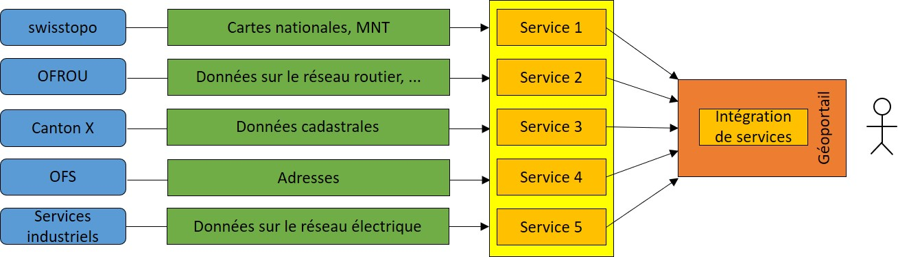
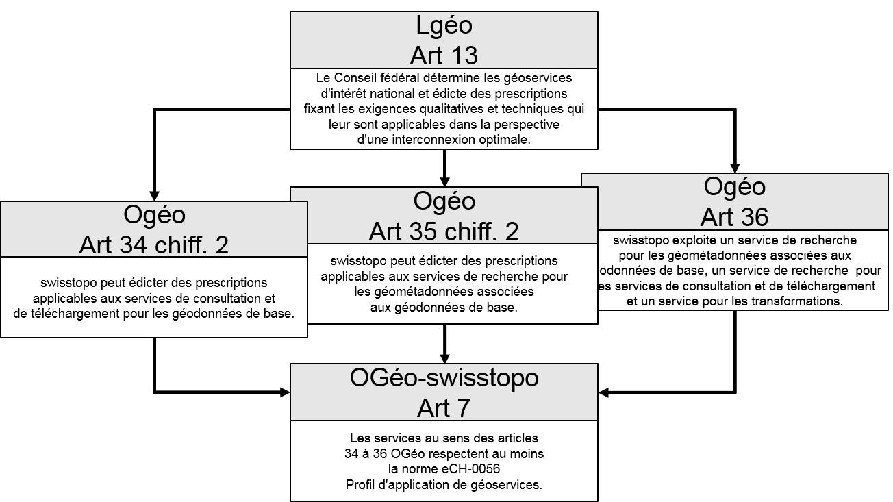

// Document settings
[.text-justify]
// Titre du document
= eCH-0056 Profil d'application de géoservices
:toc: macro
:toc-title: Table des matières
:table-caption: Tableau
:toclevels: 6
:pdf-theme: eCH
:pdf-themesdir: {docdir}
:sectlinks:
:!section-refsig:

[width="100%",cols="29%,71%",]
|===
|*Titre* |Profil d'application de géoservices
|*Code* |eCH-0056
|*Type* |Standard
|*Stade* |
|*Version* |4.0 (draft)
|*Statut* |En cours d'élaboration
|*Date de validation* |AAA-MM-JJ
|*Date de publication* |AAA-MM-JJ
|*Remplace* |eCH-0056 3.0
|*Conditions requises* |eCH-0056 3.0
|*Annexes* |
|*Langues* |Allemand (original), Français (traduction)
|*Auteurs* | Groupe spécialisé eCH Géoinformation
|*Autres participants*|
|*Editeur / distributeur*| Association eCH, Mainaustrasse 30, case postale, 8034 Zurich +
T 044 388 74 64, F 044 388 71 80 + 
http://www.ech.ch[www.ech.ch] / mailto:info@ech.ch[info@ech.ch]
|===

// Saut de page
<<<

[.section nonumber]
[#summary]
== Résumé

C'est pour qu'un large éventail d'utilisateurs dispose rapidement et simplement de géodonnées à jour, au niveau de qualité requis et à un coût approprié, conformément au but visé par la loi sur la géoinformation (LGéo) [1a], que l'infrastructure nationale de données géographiques (INDG) est mise en place et exploitée. Les géoservices revêtent un rôle central dans ce cadre. Il est possible, grâce à eux, de mettre à disposition via Internet et d'utiliser les données réparties sur l'ensemble du territoire.

Il est indispensable, pour assurer le bon fonctionnement des différents géoservices au sein de l'INDG, d'affiner le profil des spécifications existantes, parce que certaines définitions n'y figurent pas, que d'autres sont insuffisamment précises et que certaines exigences propres au contexte suisse doivent être prises en compte. L'interconnexion réclame par ailleurs une harmonisation des éléments de contenu et des métainformations. La présente norme définit ou concrétise l'implémentation de géoservices de base au travers d'un ensemble de directives et de recommandations complémentaires grâce auxquelles les services sont rendus aptes à être utilisés en pratique. Et parce que la norme est explicitement citée à l'article 7 OGéo-swisstopo [2a], les directives définies ici ont valeur de règles de droit contraignantes pour les géoservices qui se fondent sur des géodonnées de base relevant du droit fédéral, respectivement pour les services compétents pour ces données.

Les bases, les objectifs et la délimitation du profil d'application sont abordés au chapitre xref:introduction[xrefstyle=full]. Les directives et les recommandations effectives qui concrétisent des spécifications de l'OGC (Open Geospatial Consortium) à une exception près (cf. ci-dessous), sont formulées au chapitre xref:guidelines[xrefstyle=short].

// Saut de page
<<<

// Table des matières
toc::[]
:sectnums:

[.section nonumber]
== Remarque

Seule la forme masculine est utilisée dans le présent document pour désigner les personnes, afin d'en faciliter la lecture et l'intelligibilité. Cette formulation inclut bien évidemment les femmes qui occupent les fonctions citées.

// Saut de page
<<<

[#introduction]
== Introduction

[#status]
=== Statut

Projet : le document a été approuvé pour consultation publique par les référents compétents du comité d'experts et publié en conséquence.

// En cours : l'utilisation n'est autorisée qu'au sein du groupe spécialisé ou du comité d'experts. 

// Projet : le document a été approuvé pour consultation publique par les référents compétents du comité d'experts et publié en conséquence.

// Proposition : le document est soumis à l'approbation du comité d'experts, mais n'est pas encore valable sur le plan normatif. 

// Approuvé : Le document a été approuvé par le comité d'experts. Il a une valeur normative pour le domaine d'application défini dans le champ de validité fixé.

// Remplacé : le document a été remplacé par une nouvelle version plus actuelle. Son utilisation est toujours possible, mais il est recommandé d'utiliser la version la plus récente.

// Abrogé : Le document a été retiré par eCH. Il ne doit plus être utilisé.

// Suspendu : Le document a été retiré par eCH. Il ne peut pas être utilisé. Il n'a pas atteint le stade "Approuvé".

[#context]
=== Situation initiale et motivation

L'établissement de géoservices web (appelés géoservices dans la suite) crée des conditions propices aussi bien à un recours simplifié aux géoinformations par un cercle d'utilisateurs sans cesse élargi qu'à l'ouverture de nouveaux champs d'application. 
En Suisse, la Stratégie suisse pour l'information géographique et le plan d'action 2022+ [3a] ont jeté les bases de la mise en place d'une infrastructure nationale de données géographiques (INDG).

La loi sur la géoinformation (LGéo) [1a], entrée en vigueur le 1er juillet 2008, ainsi que l'ordonnance sur la géoinformation (OGéo) [4a], qui repose sur cette loi, servent aujourd'hui de base légale à l'INDG.

L'intégration de géoservices est visée dans le cadre du développement de l'INDG. Des exemples possibles d'une telle interconnexion ou réunion de géoservices proposés par des fournisseurs différents sont présentés sur la xref:fig:geoservices[xrefstyle=short].

//Figure

[#fig:geoservices]
.Accès en réseau aux géodonnées au moyen de géoservices (modifié d'après [28])

Des défis d'ordre technique en plus de ceux de nature organisationnelle sont à relever dans le cadre de la mise en oeuvre de l'interconnexion et de l'intégration de géoservices. La normalisation (par exemple ISO/TC 211) et la standardisation (par exemple Open Geospatial Consortium, OGC) servent à aplanir les problèmes rencontrés ici.

[#objectives]
=== Interconnexion des géoservices, importance de l'harmonisation des données

L'objectif principal est l'interconnexion aussi fluide que possible des géoservices au sein d'un réseau hétérogène et réparti. Selon les exigences à satisfaire, cette interconnexion peut aller de la simple visualisation jusqu'à la diffusion des données dans le respect de modèles de données harmonisés, en passant par des requêtes d'informations unifiées. L'accent est mis sur l'harmonisation des modèles de données dans le cadre de la mise en oeuvre de la LGéo [1a] et des ordonnances correspondantes [2a][4a]. L'harmonisation des modèles de données et des données concerne les champs d'action "Promouvoir l'écosystème de la géoinformation" et "Relier les géodonnées" conformément au plan d'action de la stratégie suisse pour l'information géographique.

Différents problèmes rendent aujourd'hui difficile sinon impossible l'interconnexion de géoservices proposés par des fournisseurs différents:

* une prise en charge incomplète des normes et des standards par les composants logiciels mis en oeuvre;
* le serveur et le client ne prennent pas en charge la même version de la norme ou du standard;
* un serveur ne prend pas en charge un système de projection demandé par le client;
* des couches qui pourraient être combinées transversalement entre géoservices sont visibles dans des plages d'échelles incompatibles;
* les géoservices font l'objet d'une description insuffisante voire inexistante;
* les descriptions de différents géoservices ne sont pas harmonisées entre elles;
* la dénomination des couches est hétérogène;
* lors de la réunion de géoservices couvrant des zones géographiques voisines, les limites ne sont pas harmonisées;
* les exploitations ou les traitements à caractère thématique, cas par exemple des plans de zones, ne sont pas harmonisés au-delà des limites administratives.

Les fournisseurs de géoservices doivent veiller à ce qu'une description soit assurée pour
chaque géoservice sur une base standard, conformément aux directives fédérales (SOA Po-
licies) [1] en la matière.

[#purpose]
=== Profil d'application de géoservices: but et public visés

Dans le contexte de la mise en œuvre de la LGéo [1a] (cf. section xref:legal[xrefstyle=short]), le «Profil d'application de géoservices» définit de manière juridiquement contraignante les exigences minimales que les géoservices de base doivent respecter (cf. section xref:definitions[xrefstyle=short]).

La base requise pour une utilisation interopérable est par ailleurs établie en restreignant et en précisant comme il se doit les normes et les standards sélectionnés applicables aux géoservices. Le profil d'application est ainsi conforme à ces normes / standards en toutes circonstances. Il doit être possible, dans le cadre de l'INDG et au-delà, de combiner des géoservices de fournisseurs différents et d'assurer la disponibilité des géodonnées sans limitations liées aux fournisseurs, afin de garantir l'interopérabilité en pratique.

Le présent document constitue une prescription à caractère contraignant, applicable en Suisse à l'implémentation de géoservices de base dans le cadre de la LGéo [1a]. La délimitation par rapport à d'autres groupes d'utilisateurs prend par exemple la forme de restrictions du domaine de valeurs de certains paramètres (comme l'utilisation des systèmes de référence spatiaux courants en Suisse dans la mensuration officielle).

Le profil d'application s'adresse aux fournisseurs et aux «intégrateurs» de géoservices et doit aussi les aider à choisir et à mettre en oeuvre des technologies adaptées.

Les normes / standards et les spécifications que l'on estime pertinents au moment de la révision du présent document ont été pris en compte. Le profil d'application adopte une attitude conservatrice pour ce qui concerne les normes / standards et les spécifications existants.

Ainsi, la version la plus récente n'est pas nécéssairement exigée, le choix se porte plutôt sur celle qui est la plus largement utilisée en pratique. 

[#definitions]
=== Notions et définitions

[width="100%",cols="35%,65%"]
|===
|Géodonnées de base| Par géodonnées de base au sens de l'article 34 OGéo [4a], on entend les géodonnées qui se fondent sur un acte législatif fédéral, cantonal ou communal.
|Géoservice de base| Par géoservices de base, on entend à la fois les géoservices pour les géodonnées de base (article 34 OGéo [4a]), les services pour les géométadonnées (article 35 OGéo [4a]) et les géoservices englobant plusieurs domaines (article 36 OGéo [4a]). La notion se limite aux géoservices évoqués dans ces articles. Il s'agit pour l'essentiel de services de consultation, de téléchargement et de recherche. Les auteurs tiennent à signaler que la norme eCH-0056 n'entend aucunement interpréter le droit, mais qu'il lui faut préciser la manière dont les notions mentionnées doivent être comprises dans le cadre de la présente norme.
|Service de consultation| Service web permettant d'afficher, d'agrandir, de réduire et de déplacer des jeux de géodonnées représentables, de superposer des données et de naviguer dans les géodonnées (art. 2 OGéo [4a]). + 
Dans le cadre d'eCH-0056, on entend concrètement par service de consultation un service respectant la spécification OpenGIS Web Map Server Implementation Specification [2] (WMS) ou le standard OpenGIS Web Map Tile Service Implementation Standard [3] (WMTS) ou OGC API - Tiles - Part 1: Core [4] ou Styled Layer Descriptor [22] ou Symbology Encoding [23] (SE).
|Service de téléchargement a| Service web permettant de télécharger des copies de séries de géodonnées complètes ou de parties de celles-ci (service de téléchargement prédéfini) et, si cela est réalisable, d'y accéder directement (service de téléchargement à accès direct) (art. 2 OGéo [4a]). +
Dans le cadre d'eCH-0056, on entend les services suivants par services de téléchargement:

* Un service prédéfini pour les données raster et vectorielles sur la base de la spécification STAC [5] et éventuellement de la spécification STAC-API [6]. Dans le sens d'un complément spécifique au pays, le format de transfert exigé pour la mise à disposition conforme au modèle de géodonnées vectorielles est INTERLIS-XTF selon la norme eCH-0031 version 2.0 [7] ou INTERLIS-GML selon la norme eCH-0118 version 2.0 [8].
* Un service de téléchargement à accès direct selon OpenGIS Web Feature Service Interface Standard (WFS) [9] ou selon OGC API - Features - Part 1 : Core [10] et OGC API - Features - Part 2 : Coordinate Reference Systems by Reference [11].
* Ainsi que, pour les données raster, un service conforme à l'OGC Web Coverage Service Interface Standard (WCS) [12].
|Service de recherche| Service web permettant de rechercher des géoservices et, sur la base des géométadonnées correspondantes, des jeux de géodonnées (art. 2 OGéo [4a]). +
Dans le cadre d'eCH-0056, on entend par service de recherche un service de catalogage conforme à la spécification OGC Catalogue Services 3.0 - General Model [13] ou à la spécification OGC Catalogue Services 3.0 Specification - HTTP Protocol Binding [14].
|===

[#legal]
=== Aspects juridiques

Du fait de l'entrée en vigueur, le 1er juillet 2008, de la loi sur la géoinformation [26] et des ordonnances qui lui sont associées[4a], la norme eCH-0056 devient juridiquement contraignante
pour les géoservices de base en vertu de l'article 7 OGéo-swisstopo [2a].

//Figure

[#fig:legal_aspects]
.Bases légales établissant le caractère contraignant de la norme eCH-0056

La compétence de swisstopo à définir eCH-0056 comme une norme contraignante repose sur les articles 34 à 36 OGéo [4a] (voir à ce sujet la xref:fig:legal_aspects[xrefstyle=short]).

Lorsqu'un service compétent (selon l'ordonnance OGéo [4a]) propose et/ou diffuse un ou plusieurs jeux de géodonnées de base dans un géoservice, ce dernier doit respecter la norme eCH-0056, donc se conformer à toutes les prescriptions contraignantes qu'elle contient. Il importe peu, dans ce cadre, que le géoservice développé par le service compétent concerné propose exclusivement des jeux de géodonnées de base qui lui sont attribués conformément à l'ordonnance OGéo-swisstopo [4a] ou que son offre soit étendue à des jeux de géodonnées de base relevant d'autres services compétents.

Ces conditions ne s'appliquent pas aux tiers (notamment aux acteurs du secteur privé). Toutefois, lorsque les obligations incombant à un service compétent sont déléguées à des tiers en vertu d'accords passés ou de décisions prises, ces derniers sont soumis à leur tour aux dispositions législatives en vigueur et doivent structurer les géoservices correspondants conformément à la norme eCH-0056.

Il convient d'observer, de manière générale, que l'obligation légale de respect de la norme ne concerne que les directives, c.-à-d. les prescriptions obligatoires. Les recommandations doivent être respectées dans la mesure du possible, mais aucune obligation légale ne l'impose.

[#scope]
=== Délimitation

Dans le présent profil d'application, les géoservices de base sont standardisés en se fondant sur les normes et les standards référencés. Des exigences visant à garantir l'interopérabilité sont prises en compte en plus de celles spécifiques à notre pays.
L'implémentation des différents géoservices est régie par les spécifications d'implémentation référencées et n'est pas traitée dans la présente norme. Les aspects suivants, également relatifs à des questions d'importance dans le cadre de l'établissement de géoservices, ne sont pas couverts par le profil d'application de géoservices:

* la conception logicielle des différents géoservices
* l'architecture des paysages de géoservices
* les géoservices en tant que produits (exemples: modèles de prix, marketing, aspects ressortissant à l'exploitation).

Les normes établies doivent être prises en compte de manière générale. En font notamment partie eCH-0014: SAGA.ch [15]. 

[#structure]
=== Structure du profil d'application

Les principales composantes du contenu du profil d'application sont :

* le chapitre xref:introduction[xrefstyle=full]
* le chapitre xref:guidelines[xrefstyle=full]

Les directives et les recommandations sont traitées dans un chapitre distinct pour chaque spécification de géoservices, selon une structure uniforme. Celle-ci comprend les éléments suivants :

* Brève description
* Version actuelle : est considérée comme version actuelle celle qui a le niveau de document le plus élevé, dans le meilleur des cas la version finale. Ainsi, outre le numéro de version proprement dit, le statut du document et l'organisation responsable qui le détermine sont également indiqués. La date de publication est également indiquée.
* Directives : elles sont numérotées par spécification et par classe d'exigences. Les directives définissent des exigences obligatoires (voir section xref:conformance[xrefstyle=short]).
* Recommandations : elles sont numérotées par spécification et par classe d'exigences. Les recommandations sont des spécifications non obligatoires (voir section xref:conformance[xrefstyle=short]).

Le profil d'application définit dans les directives quelle version d'une norme doit être prise en charge.

[#update]
=== Mise à jour

Le présent document est périodiquement mis à jour, une distinction étant toutefois établie entre des révisions d'une certaine ampleur (exemple: modification d'une directive, introduction de nouveaux standards) et des changements ou des compléments de moindre portée.
Les périodicités suivantes sont définies pour la mise à jour:

* Révisions d'une certaine ampleur > 2 ans
* Modifications de moindre portée < 2 ans

Les demandes de modification (ou Change-Requests) peuvent être directement adressées au centre opérationnel e-geo.ch (info@e-geo.ch). 

[#conformance]
=== Conformité

Afin d'éviter toute confusion dans la terminologie, nous définissons ici les expressions utilisées dans les directives et les recommandations.

[width="100%",cols="19%,81%"]
|===
|Directive| Une directive est une disposition qu’il est impératif de respecter pour se conformer au profil d’application. La mise en œuvre des directives permet notamment de respecter les règles de droit énoncées à l’article 7 OGéo-swisstopo [2a].

Les directives sont signalées au chapitre xref:guidelines[xrefstyle=short] par le mot-clé "*DOIT*".

|Recommandation| Une recommandation est une prescription non obligatoire. Elle devrait être respectée dans la mesure du possible afin d'améliorer l'interopérabilité, mais n'a aucun effet sur la conformité au profil d'application.

Les recommandations sont signalées au chapitre xref:guidelines[xrefstyle=short] par le mot-clé "*DEVRAIT*".
Directives et recommandations sont associées en classes d'exigences.
Pour chaque classe d'exigence est défini une URI unique, qui permet de faire référence à la classe d'exigence dans le profil d'application. La syntaxe de l'URI est la suivante: https://ech.ch/fr/0056/main/base/req/{classe d'exigence}. Par exemple, la classe d'exigence "http" est définie par l'URI https://ech.ch/fr/0056/main/base/req/http.
Afin de garder un suivi avec les anciennes versions de la norme eCH-0056, les anciennes références des exigences et recommandations (p.ex. `WMS-01`) ont été apposées à la nouvelle nomenclature.
|===

La définition des termes "*DOIT*" et "*DEVRAIT*" s'inspire de eCH-0003 [6a]. Les expressions sont écrites en caractères gras et en MAJUSCULES.
La définition des classes d'exigences s'inspire du document: "The Specification Model — A Standard for Modular specifications" [25].

[width="100%",cols="19%,81%",options="noheader",]
|===
|*DOIT* |Cette expression signifie que la directive doit être remplie dans tous les cas.
|*DEVRAIT* |Ce terme signifie qu'il peut exister de bonnes raisons, dans certains cas, d'ignorer cette directive. Toutes les conséquences d'une telle décision doivent toutefois être mesurées et soigneusement soupesées avant d'emprunter cette voie.
|===

[#guidelines]
== Directives et recommandations normatives
[#general_rules]
=== Règles générales
[#http]
==== Réponse à une requête HTTP(S)

[width="100%",cols="41%,59%",options="noheader",]
|===
|*Classe d’exigences* |https://ech.ch/fr/0056/main/base/req/http
|Type d’objectif |Encoding
|Dépendance |N/A
|===

[width="100%",cols="41%,59%",options="noheader",]
|===
|*Directive 1* |/req/http/response
|A| Un serveur *DOIT* renvoyer un document qui correspond au type de média demandé.
|B| Un serveur *DOIT* renvoyer un document qui respecte l'encodage des caractères UTF-8.
|===

[#date-time]
==== Indication de la date et de l'heure

[width="100%",cols="41%,59%",options="noheader",]
|===
|*Classe d’exigences* |https://ech.ch/fr/0056/main/base/req/datetime
|Type d’objectif |Encoding
|Dépendance |ISO 8601-1:2019 Date et heure — Représentations pour l'échange d'information — Partie 1: Règles de base
|===

[width="100%",cols="41%,59%",options="noheader",]
|===
|*Directive 1* |/req/datetime/format
|A| L'indication de la date et de l'heure *DOIT* être conforme à la norme "ISO
8601-1:2019" [10] : +

Exemple de format +

YYYY «2023» +
YYYY-MM «2023-08» +
YYYY-MM-DD «2023-08-31» +
YYYY-MM-DDThh «2023-08-31T16» +
YYYY-MM-DDThh:mm «2023-08-31T16:55» +
YYYY-MM-DDThh:mm:ss «2023-08-31T16:55:01» +

Seules les indications de date et d'heure figurant dans des mentions, qui doivent être lisibles exclusivement par des êtres humains, constituent une exception.
|===

[#language]
==== Langue

[width="100%",cols="24%,76%",options="noheader",]
|===
|*Classe d’exigences* |https://ech.ch/fr/0056/main/base/req/lang
|Type d’objectif |Web API
|Dépendances |https://portal.ogc.org/files/?artifact_id=14416[OGC Web Services Common Standard 2.0.0] +
https://docs.ogc.org/is/19-072/19-072.html#_98ff4350-10c4-454e-b5da-6802f1ad70d7[OGC API - Common - Part 1: Core (1.0.0) Core Requirements Class] 
|===

[width="100%",cols="24%,76%",options="noheader",]
|===
|*Directive 1* |/req/string-i18n
|A (LANG-01) |Sauf définition dans une norme spécifique, le mécanisme habituel de négociation de contenu HTTP [18] *DOIT* être utilisé pour la négociation de la langue.
|B (LANG-02) |Les balises de langue DOIVENT être conformes à la norme"RFC 5646" [19].
|C (LANG-03) |Les valeurs de chaîne contenant du texte linguistique DOIVENT correspondre à la langue renvoyée par le serveur.
|D (LANG-04) |En plus de l'exigence *1 A*, un serveur *DOIT* supporter un paramètre de requête `AcceptLanguages` (services OWS) ou `lang` (OGC API).
|E (LANG-05) |Pour les objets de type liens, l'attribut `xml:lang` (services OWS) ou `hreflang`(OGC API) *DOIT* être utilisé pour indiquer la langue de la ressource référencée [24].
|===

[#metadata]
==== Métadonnées

[width="100%",cols="24%,76%",options="noheader",]
|===
|*Classe d’exigences* |https://ech.ch/fr/0056/main/base/req/metadata
|Type d’objectif |Web API
|Dépendances |https://portal.ogc.org/files/?artifact_id=14416[OGC Web Services Common Standard 2.0.0] +
https://docs.ogc.org/is/19-072/19-072.html[OGC API - Common - Part 1: Core (1.0.0) Core Requirements Class] 
|===

[width="100%",cols="24%,76%",options="noheader",]
|===
|*Directive 1* |/req/metadata
|A (META-01) |Un géoservice *DOIT* être décrit dans le catalogue national de géométadonnées.
|B (META-02) |Si une norme spécifique l'autorise, un géoservice *DOIT* fournir un lien vers les métadonnées de service dans le catalogue national de géométadonnées.
|C (META-03) |La description du service fournie par le géoservice lui-même *DOIT* correspondre à la description correspondante dans le catalogue national de géométadonnées.
|D (META-04) |Si une norme spécifique le permet, un géoservice *DOIT* pour chaque ensemble de données géographiques (p.ex : "Layer" pour le WMS et le WMTS, "Feature Type" pour le WFS, "Coverage" pour le WCS, "Collection" pour les API OGC et STAC) fournir un lien vers les métadonnées de données.
|E (META-05) |La description des collections de données géographiques fournie par le service géographique lui-même *DOIT* correspondre à la description correspondante dans le catalogue national de géométadonnées.
|F (META-06) |Lorsqu'une norme particulière le permet, un service géographique *DOIT* fournir des informations de contact sur le fournisseur de services et sur l'attribution des séries de données géographiques fournies.
|===

[width="100%",cols="24%,76%",options="noheader",]
|===
|*Recommandation 1* |/rec/metadata
|A (META-07) | Si une norme particulière l'autorise, un service géographique *DEVRAIT* fournir un lien vers les données pour chaque set de données géographiques.
|===

Des directives et recommandations spécifiques concernant les géométadonnées suivent dans les sections consacrées aux différents géoservices.

[#crs]
==== Systèmes de coordonnées

L'IOGP Geomatics Committee catalogue les systèmes de coordonnées dans le monde entier et attribue à chacun d'eux des numéros d'identification uniques (appelés "codes EPSG"). La base de données EPSG [7a] sert de norme pour le référencement des systèmes de référence de coordonnées et des transformations.

En Suisse, le cadre de référence est CH1903+/MN95, qui correspond au code EPSG:2056.

[width="100%",cols="24%,76%",options="noheader",]
|===
|*Classe d’exigences* |https://ech.ch/fr/0056/main/base/req/crs
|Type d’objectif |Web API
|Dépendances |https://portal.ogc.org/files/?artifact_id=14416[OGC Web Services Common Standard 2.0.0] +
http://www.opengis.net/doc/IS/ogcapi-features-1/1.0[OGC API - Features - Part 1: Core 1.0] + 
https://docs.ogc.org/is/18-058r1/18-058r1.html#_requirements_class_coordinate_reference_systems_by_reference[OGC API - Features - Part 2: Coordinate Reference Systems by Reference] 
|===

[width="100%",cols="24%,76%",options="noheader",]
|===
|*Directive 1* |/req/crs
|A (CRS-01) |Un géoservice *DOIT* supporter le système de référence suisse CH1903+ ("EPSG:2056", cadre de référence MN95).
|===

[width="100%",cols="24%,76%",options="noheader",]
|===
|*Recommandation 1* |/rec/crs
|A (CRS-02) |Un géoservice *DEVRAIT* supporter le système de référence de coordonnées global WGS84 en coordonnées géographiques avec projection pseudo-plaque-carrée ("EPSG:4326") et projection pseudo-Mercator ("EPSG:3857") ainsi que le système de référence de coordonnées européen ETRS89 en coordonnées géographiques ("EPSG:4258").
|B (CRS-03) |Un géoservice *DEVRAIT* supporter les systèmes de référence de coordonnées ETRS89 LAEA Europe ("EPSG : 3035"), LCC Europe ("EPSG : 3034") et UTM Zone 32N ("EPSG : 3044").
|===

[#tilematrixset]
==== Matrice de tuiles suisse CH1903+ / LV95
[width="100%",cols="24%,76%",options="noheader",]
|===
|*Classe d’exigences* |https://ech.ch/fr/0056/main/base/req/tms
|Type d’objectif |Web API
|Dépendance | 
https://docs.ogc.org/is/17-083r4/17-083r4.html#toc48[OGC Two Dimensional Tile Matrix Set and Tile Set Metadata] 
|===

[width="100%",cols="24%,76%",options="noheader",]
|===
|*Directive 1* |/req/tms
|A | Les niveaux de zoom prédéfinis pour la mise en œuvre d'un service de tuiles 2D *DOIVENT* comprendre les valeurs suivantes pour le système de référence CH1903+ : +
1 pixel correspond à 4000, 2000, 1000, 500, 250, 100, 50, 20, 10, 5, 2.5, 1, 0.5, 0.25, 0.1, 0.05 mètres. +
Si elle n'est pas définie dans une norme spécifique, la taille des pixels est régie par la norme "OGC Two Dimensional Tile Matrix Set" [21].
|===

[width="100%",cols="24%,76%",options="noheader",]
|===
|*Recommandation 1* |/rec/tms
|A | Pour toute définition d'une matrice de tuiles, le point d'origine suivant *DEVRAIT* être utilisé : `2419995.75, 1350004.29`
|B |Un géoservice *DEVRAIT* idéalement utiliser la définition du jeu de matrices de tuiles suisse ci-dessous. 
|===

:table-Swiss2DTMS: 
.Définition du TileMatrixSet suisse CH1903+ / LV95
[cols="a,a,a,a,a"]
|===
5+| *CRS*: http://www.opengis.net/def/crs/EPSG/0/2056, CH1903+ / LV95

*BBOX LowerLeft:* 2419995.75, 1030006.66

*BBOX UpperRight:* 2900009.73, 1350004.29

*PointOfOrigin*: 2419995.75, 1350004.29

*TileWidth*: 256

*TileHeight*: 256
| *TileMatrix id* | *Scale Denominator* | *Cell Size (m)* | *Matrix Width* | *Matrix Height*
| 0 | 14285714.285714284 | 4000 | 1   | 1
| 1 | 7142857.142857142  | 2000 | 1   | 1
| 2 | 3571428.571428571  | 1000 | 2   | 2
| 3 | 1785714.2857142854 | 500  | 4   | 3
| 4 | 892857.1428571427  | 250  | 8   | 5
| 5 | 357142.8571428571  | 100  | 19  | 3
| 6 | 178571.42857142855 | 50   | 38  | 25
| 7 | 71428.57142857142  | 20   | 94  | 63
| 8 | 35714.28571428571  | 10   | 188 | 125
| 9 | 17857.142857142855 | 5    | 375 | 250
| 10 | 8928.571428571428 | 2.5  | 750 | 500
| 11 | 3571.428571428571 | 1    | 1875 | 1250
| 12 | 1785.7142857142856 | 0.5 | 3750 | 2500
| 13 | 892.8571428571428 | 0.25 | 7500 | 5000
| 14 | 357.14285714285717 | 0.1 | 18750 | 12500
| 15 | 178.57142857142858 | 0.05 | 37500 | 25000
|===

Afin d'en faciliter l'implémentation, 2 exemples d'encodage (`XML` et `JSON`) de la définition de la TileMatrixSet suisse CH1903+ / LV95 figurent à l'annexe xref:appendix-g[xrefstyle=full].

[#visualization]
=== Service de représentation

Un service de représentation est un service Internet qui permet d'afficher, d'agrandir, de réduire et de déplacer des jeux de géodonnées représentables, de superposer des données et de naviguer dans les géodonnées (art. 2 OGéo [4a]).

Dans le cadre de eCH-0056, on entend concrètement par service de représentation un service selon OpenGIS Web Map Server Implementation Specification [2] (WMS) ou OpenGIS Web Map Tile Service Implementation Standard [3] (WMTS) ou OGC API - Tiles - Part 1 : Core [4].

include::./docs/visualization-services/wms-ech-0056-visualization-fr.adoc[]
include::./docs/visualization-services/wmts-ech-0056-visualization-fr.adoc[]
include::./docs/visualization-services/oatiles-ech-0056-visualization-fr.adoc[]

[#download]
=== Service de téléchargement

Un service de téléchargement est un service Internet qui permet de télécharger des copies de séries de géodonnées complètes ou de parties de celles-ci (*service de téléchargement prédéfini*) et, si cela est réalisable, d'y accéder directement (*service de téléchargement en accès direct*) (art. 2 OGéo [4a]).

Dans le cadre d'eCH-0056, on entend par service de téléchargement les services suivants :

* un service *prédéfini*, *basé sur des fichiers* pour les données raster et vectorielles sur la base de la spécification STAC [5] et éventuellement de la spécification STAC-API [6]. Dans le sens d'un complément spécifique au pays, le format de transfert exigé pour la mise à disposition conforme au modèle de géodonnées vectorielles est INTERLIS-XTF selon la norme eCH-0031 version 2.0 [7] ou INTERLIS-GML selon la norme eCH-0118 version 2.0 [8].
* Un *service de téléchargement à accès direct* selon OpenGIS Web Feature Service Interface Standard (WFS) [9] ou selon OGC API - Features - Part 1 : Core [10] et OGC API - Features - Part 2 : Coordinate Reference Systems by Reference [11].
* Ainsi que pour les données raster un service selon OGC Web Coverage Service Interface Standard (WCS) [12].

include::./docs/download-services/stac-ech-0056-download-fr.adoc[]
include::./docs/download-services/wfs-ech-0056-download-fr.adoc[]
include::./docs/download-services/oafeat-ech-0056-download-fr.adoc[]
include::./docs/download-services/wcs-ech-0056-download-fr.adoc[]

[#search]
=== Service de recherche

include::./docs/search-services/csw-ech-0056-search-fr.adoc[]

[#other]
=== Autres services

include::./docs/other-services/adr-0056-other-fr.adoc[]

[#responsibility]
== Exclusion de responsabilité - droits de tiers

Les normes élaborées par l'Association *eCH* et mises gratuitement à la disposition des utilisateurs, ou celles qu'*eCH* référence, ont seulement valeur de recommandations. L'Association *eCH* ne peut en aucun cas être tenue pour responsable des décisions ou mesures prises par un utilisateur sur la base des documents qu'elle met à disposition. L'utilisateur est tenu d'étudier attentivement les documents avant de les mettre en application et au besoin de procéder aux consultations appropriées. Les normes *eCH* ne remplacent en aucun cas les consultations techniques, organisationnelles ou juridiques appropriées dans un cas concret.

Les documents, procédures, méthodes, produits, normes et standards référencés dans les normes *eCH* peuvent le cas échéant être protégés par des dispositions légales sur les marques, les droits d'auteur ou les brevets. L'obtention des autorisations nécessaires auprès des personnes ou organisations détentrices des droits relève de la seule responsabilité de l'utilisateur.
Bien que l'Association *eCH* mette tout en oeuvre pour assurer la qualité des normes qu'elle publie, elle ne peut fournir aucune assurance ou garantie quant à l'absence d'erreur, l'actualité, l'exhaustivité et l'exactitude des documents et informations mis à disposition. La teneur des normes *eCH* peut être modifiée à tout moment sans préavis.

Toute responsabilité relative à des dommages que l'utilisateur pourrait subir par suite de l'utilisation des normes *eCH* est exclue dans les limites des réglementations applicables.

[#copyright]
== Droits d'auteur

Tout auteur de normes *eCH* reste détenteur de la propriété intellectuelle qui leur est associée. Il s'engage toutefois à mettre, pour autant que cela soit possible, cette propriété intellectuelle ou les droits qu'il détient sur une propriété intellectuelle de tiers gratuitement à la disposition des groupes spécialisés concernés et de l'Association *eCH*, pour une utilisation et un développement ultérieurs sans restriction dans le cadre des buts poursuivis par l'association.
Les normes élaborées par les groupes spécialisés peuvent être utilisées, diffusées et développées gratuitement et sans restriction par l'Association *eCH*, pour autant que les auteurs concernés soient cités.

Les normes *eCH* sont intégralement documentées et libres de toute restriction relevant du
droit des brevets et/ou des licences. La documentation afférente peut être obtenue gratuitement.
Les présentes dispositions s'appliquent exclusivement aux normes élaborées par *eCH* et ne s'étendent pas aux normes ou produits de tiers auxquels il est fait référence dans les normes *eCH*. Les normes contiennent les informations correspondantes relatives aux droits de tiers.

// Annexe A – Références normatives et bibliographiques

[#appendix-a]
[.appendix nonumber]
== Annexe A – Références normatives et bibliographiques

include::./docs/appendices/appendix-a-fr.adoc[]

// Annexe B – Collaboration et vérification

[#appendix-b]
[.appendix nonumber]
== Annexe B – Collaboration et vérification

include::./docs/appendices/appendix-b-fr.adoc[]

// Annexe C – Abréviations &  glossaire

[#appendix-c]
[.appendix nonumber]
== Annexe C – Abréviations &  glossaire

include::./docs/appendices/appendix-c-fr.adoc[]

// Annexe D – Modifications par rapport à la version 3.0

[#appendix-d]
[.appendix nonumber]
== Annexe D - Modifications par rapport à la version 3.0

include::./docs/appendices/appendix-d-fr.adoc[]

// Annexe E – Liste des figures

[#appendix-e]
[.appendix nonumber]
== Annexe E – Liste des figures

* xref:fig:geoservices[xrefstyle=full]
* xref:fig:legal_aspects[xrefstyle=full]

// Annexe F – Nouvelles tendances en matière de géostandards

[#appendix-f]
[.appendix nonumber]
== Annexe F – Nouvelles tendances en matière de géostandards

include::./docs/appendices/appendix-f-fr.adoc[]

// Annexe G – Exemples d'encodage de la définition de la TileMatrixSet suisse CH1903+ / LV95

[#appendix-g]
[.appendix nonumber]
== Annexe G – Exemples d'encodage de la définition de la TileMatrixSet suisse CH1903+ / LV95

include::./docs/appendices/appendix-g-fr.adoc[]