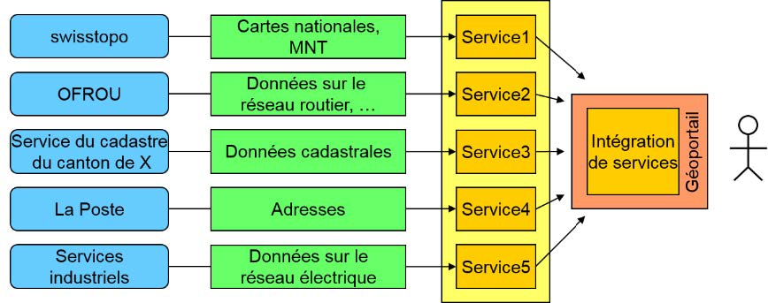
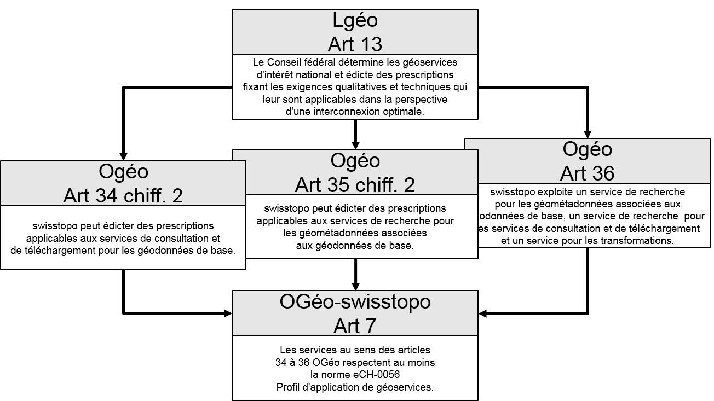

// Document settings
[.text-justify]
// Document title
= eCH-0056 Profil d'application de géoservices
// Table of contents
:toc: left
:toc-title: Table des matières
:toclevels: 5
:sectnums:

// Figures
:figure-caption: Figure

[.section nonumber]
== Résumé

C'est pour qu'un large éventail d'utilisateurs dispose rapidement et simplement de géodonnées à jour, au niveau de qualité requis et à un coût approprié, conformément au but visé par la loi sur la géoinformation (LGéo) [1a], que l'infrastructure nationale de données géographiques (INDG) est mise en place et exploitée. Les géoservices revêtent un rôle central dans ce cadre. Il est possible, grâce à eux, de mettre à disposition via Internet et d'utiliser les données réparties sur l'ensemble du territoire.
Il est indispensable, pour assurer le bon fonctionnement des différents géoservices au sein de l'INDG, d'affiner le profil des spécifications existantes, parce que certaines définitions n'y figurent pas, que d'autres sont insuffisamment précises et que certaines exigences propres au contexte suisse doivent être prises en compte. L'interconnexion réclame par ailleurs une harmonisation des éléments de contenu et des métainformations. La présente norme définit ou concrétise l'implémentation de géoservices de base au travers d'un ensemble de directives et de recommandations complémentaires grâce auxquelles les services sont rendus aptes à être utilisés en pratique. Et parce que la norme est explicitement citée à l'article 7 OGéo-swisstopo [2a], les directives définies ici ont valeur de règles de droit contraignantes pour les géoservices qui se fondent sur des géodonnées de base relevant du droit fédéral, respectivement pour les services compétents pour ces données.

Les bases, les objectifs et la délimitation du profil d'application sont abordés au chapitre 3. Les directives et les recommandations effectives qui concrétisent des spécifications de l'OGC (Open Geospatial Consortium) à une exception près (cf. cidessous), sont formulées au chapitre 6.

[NOTE]
====
Revoir les références aux chapitres et introduire des liens
====

[.section nonumber]
== Remarque

Seule la forme masculine est utilisée dans le présent document pour désigner les personnes, afin d'en faciliter la lecture et l'intelligibilité. Cette formulation inclut bien évidemment les femmes qui occupent les fonctions citées.

== Introduction
=== Situation initiale et motivation

L'établissement de géoservices web (appelés géoservices dans la suite) crée des conditions propices aussi bien à un recours simplifié aux géoinformations par un cercle d'utilisateurs sans cesse élargi qu'à l'ouverture de nouveaux champs d'application. 
En Suisse, la Stratégie suisse pour l'information géographique et le plan d'action 2022+ [3a] ont jeté les bases de la mise en place d'une infrastructure nationale de données géographiques (INDG).
La loi sur la géoinformation (LGéo) [1a], entrée en vigueur le 1er juillet 2008, ainsi que l'ordonnance sur la géoinformation (OGéo) [4a], qui repose sur cette loi, servent aujourd'hui de base légale à l'INDG
L'intégration de géoservices est visée dans le cadre du développement de l'INDG. Des exemples possibles d'une telle interconnexion ou réunion de géoservices proposés par des fournisseurs différents sont présentés sur la figure 1.

[NOTE]
====
Revoir les reférences (bibliographie + figure) et insérer des hyperliens
====

//Figure

.accès en réseau aux géodonnées au moyen de géoservices (modifié d'après [28])

[NOTE]
====
Modifier la figure
====

Des défis d'ordre technique en plus de ceux de nature organisationnelle sont à relever dans le cadre de la mise en oeuvre de l'interconnexion et de l'intégration de géoservices. La normalisation (par exemple ISO/TC 211) et la standardisation (par exemple Open Geospatial Consortium, OGC) servent à aplanir les problèmes rencontrés ici.

=== Interconnexion des géoservices, importance de l'harmonisation des données

L'objectif principal est l'interconnexion aussi fluide que possible des géoservices au sein d'un réseau hétérogène et réparti. Selon les exigences à satisfaire, cette interconnexion peut aller de la simple visualisation jusqu'à la diffusion des données dans le respect de modèles de données harmonisés, en passant par des requêtes d'informations unifiées. L'accent est mis sur l'harmonisation des modèles de données dans le cadre de la mise en oeuvre de la LGéo [1a] et des ordonnances correspondantes [2a][4a]. L'harmonisation des modèles de données et des données concerne les champs d'action "Promouvoir l'écosystème de la géoinformation" et "Relier les géodonnées" conformément au plan d'action de la stratégie suisse pour l'information géographique.

Différents problèmes rendent aujourd'hui difficile sinon impossible l'interconnexion de géo-
services proposés par des fournisseurs différents:

* une prise en charge incomplète des normes et des standards par les composants logiciels
mis en oeuvre;
* le serveur et le client ne prennent pas en charge la même version de la norme ou du
standard;
* un serveur ne prend pas en charge un système de projection demandé par le client;
* des couches qui pourraient être combinées transversalement entre géoservices sont visibles dans des plages d'échelles incompatibles;
* les géoservices font l'objet d'une description insuffisante voire inexistante;
* les descriptions de différents géoservices ne sont pas harmonisées entre elles;
* la dénomination des couches est hétérogène;
* lors de la réunion de géoservices couvrant des zones géographiques voisines, les limites ne sont pas harmonisées;
* les exploitations ou les traitements à caractère thématique, cas par exemple des plans de zones, ne sont pas harmonisés au-delà des limites administratives.

Les fournisseurs de géoservices doivent veiller à ce qu'une description soit assurée pour
chaque géoservice sur une base standard, conformément aux directives fédérales (SOA Po-
licies) [1] en la matière.

=== Profil d'application de géoservices: but et public visés

Dans le contexte de la mise en œuvre de la LGéo [1a] (cf. § 3.5), le «Profil d'application de géoservices» définit de manière juridiquement contraignante les exigences minimales que les géoservices de base doivent respecter (cf. § 3.4).
La base requise pour une utilisation interopérable est par ailleurs établie en restreignant et en précisant comme il se doit les normes et les standards sélectionnés applicables aux géoservices. Le profil d'application est ainsi conforme à ces normes / standards en toutes circonstances. Il doit être possible, dans le cadre de l'INDG et au-delà, de combiner des géoservices de fournisseurs différents et d'assurer la disponibilité des géodonnées sans limitations liées aux fournisseurs, afin de garantir l'interopérabilité en pratique.
Le présent document constitue une prescription à caractère contraignant, applicable en Suisse à l'implémentation de géoservices de base dans le cadre de la LGéo [1a]. La délimitation par rapport à d'autres groupes d'utilisateurs prend par exemple la forme de restrictions du domaine de valeurs de certains paramètres (comme l'utilisation des systèmes de référence spatiaux courants en Suisse dans la mensuration officielle).
Le profil d'application s'adresse aux fournisseurs et aux «intégrateurs» de géoservices et doit aussi les aider à choisir et à mettre en oeuvre des technologies adaptées.
Les normes / standards et les spécifications que l'on estime pertinents au moment de la révision du présent document ont été pris en compte. Le profil d'application adopte une attitude conservatrice pour ce qui concerne les normes / standards et les spécifications existants.
Ainsi, la version la plus récente n'est pas nécéssairement exigée, le choix se porte plutôt sur celle qui est la plus largement utilisée en pratique. 

[NOTE]
====
Revoir la numération des chapitres et insérer des hyperliens
====

=== Notions et définitions

[width="100%",cols="35%,65%"]
|===
|Géodonnées de base| Par géodonnées de base au sens de l'article 34 OGéo [4a], on entend les géodonnées qui se fondent sur un acte législatif fédéral, cantonal ou communal.
|Géoservice de base| Par géoservices de base, on entend à la fois les géoservices pour les géodonnées de base (article 34 OGéo [4a]), les services pour les géométadonnées (article 35 OGéo [4a]) et les géoservices englobant plusieurs domaines (article 36 OGéo [4a]). La notion se limite aux géoservices évoqués dans ces articles. Il s'agit pour l'essentiel de services de consultation, de téléchargement, de re- cherche et de transformation. Les auteurs tiennent à signaler que la norme eCH-0056 n'entend aucunement interpréter le droit, mais qu'il lui faut préciser la manière dont les notions mentionnées doivent être comprises dans le cadre de la présente norme.
|Service de consultation| Service web permettant d'afficher, d'agrandir, de réduire et de déplacer des jeux de géodonnées représentables, de superposer des données et de naviguer dans les géodonnées (art. 2 OGéo [4a]). + 
Dans le cadre d'eCH-0056, on entend concrètement par service de consultation un service respectant la spécification OpenGIS Web Map Server Implementation Specification [2] (WMS) ou le standard OpenGIS Web Map Tile Service Implementation Standard [3] (WMTS) ou OGC API - Tiles - Part 1: Core [4] ou Styled Layer Descriptor [22] ou Symbology Encoding [23] (SE).
|Service de téléchargement a| Service web permettant de télécharger des copies de séries de géodonnées complètes ou de parties de celles-ci (service de téléchargement prédéfini) et, si cela est réalisable, d'y accéder directement (service de téléchargement à accès direct) (art. 2 OGéo [4a]). +
Dans le cadre d'eCH-0056, on entend les services suivants par services de téléchargement:

* Un service prédéfini pour les données raster et vectorielles sur la base de la spécification STAC [5] et éventuellement de la spécification STAC-API [6]. Dans le sens d'un complément spécifique au pays, le format de transfert exigé pour la mise à disposition conforme au modèle de géodonnées vectorielles est INTERLIS-XTF selon la norme eCH-0031 version 2.0 [7] ou INTERLIS-GML selon la norme eCH-0118 version 2.0 [8].
* Un service de téléchargement à accès direct selon OpenGIS Web Feature Service Interface Standard (WFS) [9] ou selon OGC API - Features - Part 1 : Core [10] et OGC API - Features - Part 2 : Coordinate Reference Systems by Reference [11].
* Ainsi que, pour les données raster, un service conforme à l'OGC Web Coverage Service Interface Standard (WCS) [12].
|Service de recherche| Service web permettant de rechercher des géoservices et, sur la base des géométadonnées correspondantes, des jeux de géodonnées (art. 2 OGéo [4a]). +
Dans le cadre d'eCH-0056, on entend par service de recherche un service de catalogage conforme à la spécification OGC Catalogue Services 3.0 - General Model [13] ou à la spécification OGC Catalogue Services 3.0 Specification - HTTP Protocol Binding [14].
|===

=== Aspects juridiques

Du fait de l'entrée en vigueur, le 1er juillet 2008, de la loi sur la géoinformation [26] et des or-
donnances qui lui sont associées[4a], la norme eCH-0056 devient juridiquement contraignante
pour les géoservices de base en vertu de l'article 7 OGéo-swisstopo [2a].

//Figure

.bases légales établissant le caractère contraignant de la norme eCH-0056

La compétence de swisstopo à définir eCH-0056 comme une norme contraignante repose sur les articles 34 à 36 OGéo [4a] (cf. à ce sujet la figure 2).
Lorsqu'un service compétent (selon l'annexe 1 OGéo [4a]) propose et/ou diffuse un ou plusieurs jeux de géodonnées de base dans un géoservice, ce dernier doit respecter la norme eCH-0056, donc se conformer à toutes les prescriptions contraignantes qu'elle contient. Il importe peu, dans ce cadre, que le géoservice développé par le service compétent concerné propose exclusivement des jeux de géodonnées de base qui lui sont attribués conformément à l'annexe 1 OGéo [4a] ou que son offre soit étendue à des jeux de géodonnées de base relevant d'autres services compétents.
Ces conditions ne s'appliquent pas aux tiers (notamment aux acteurs du secteur privé). Toutefois, lorsque les obligations incombant à un service compétent sont déléguées à des tiers en vertu d'accords passés ou de décisions prises, ces derniers sont soumis à leur tour aux dispositions législatives en vigueur et doivent structurer les géoservices correspondants conformément à la norme eCH-0056.
Il convient d'observer, de manière générale, que l'obligation légale de respect de la norme ne concerne que les directives, c.-à-d. les prescriptions obligatoires. Les recommandations doivent être respectées dans la mesure du possible, mais aucune obligation légale ne l'impose.

[NOTE]
====
Revoir les références et insérer des hyperliens
====

=== Délimitation

Dans le présent profil d'application, les géoservices de base sont standardisés en se fondant sur les normes et les standards référencés. Des exigences visant à garantir l'interopérabilité sont prises en compte en plus de celles spécifiques à notre pays.
L'implémentation des différents géoservices est régie par les spécifications d'implémentation référencées et n'est pas traitée dans la présente norme. Les aspects suivants, également relatifs à des questions d'importance dans le cadre de l'établissement de géoservices, ne sont pas couverts par le profil d'application de géoservices:

* la conception logicielle des différents géoservices
* l'architecture des paysages de géoservices
* les géoservices en tant que produits (exemples: modèles de prix, marketing, aspects ressortissant à l'exploitation).

Les normes établies doivent être prises en compte de manière générale. En font notamment partie eCH-0014: SAGA.ch [15]. 

[NOTE]
====
Revoir la référence et insérer un lien
====

=== Nouvelles tendances en matière de géostandards

La recherche, l'accès et l'utilisation de données géographiques diffusées par des infrastructures de données géographiques (IDG) basées sur les OGC Web Service Standards (WMS, WFS, WCS, WPS, etc.) présentent certains inconvénients : Ces ne sont en principe pas adaptés à l'indexation de leur contenu par les moteurs de recherche (les données sont introuvables sur le web) et sont difficiles à utiliser pour les utilisateurs non spécialisés.
Fort de ce constat, l'Open Geospatial Consortium s'est associé au W3C, pour produire le document https://www.w3.org/TR/sdw-bp[«Spatial Data on the Web Best Practices»] Ce document donne des conseils sur les meilleures pratiques liées à la publication de données spatiales sur le Web et à l'utilisation des technologies Web dans le domaine de la localisation. Ces recommandations sont destinées aux praticiens, y compris les développeurs Web et les experts géospatiaux, et sont compilées sur la base de preuves d'application dans le monde réel. Ces bonnes pratiques suggèrent un changement d'orientation significatif par rapport aux infrastructures de données spatiales traditionnelles en adoptant une approche basée sur les normes générales du Web. La localisation étant souvent le facteur commun à plusieurs ensembles de données, les données spatiales constituent un complément particulièrement utile au Web de données.
Sur la base de cette expérience, l'Open Geospatial Consortium a commencé à développer une nouvelle famille de normes : les https://ogcapi.ogc.org[OGC API]. Ces nouveaux standards doivent permettre à chacun de fournir et d'utiliser facilement des données géographiques sur le web et d'intégrer ces données avec tout autre type d'information. Ces normes définissent des API centrées sur les ressources, qui tirent profit des techniques modernes de développement web.
Les API de l'OGC sont conçues pour que N'IMPORTE QUI puisse facilement fournir et utiliser des données géospatiales sur le web, et intégrer ces données à n'importe quel autre type d'information. Ces normes s'appuient sur l'héritage des normes de services Web de l'OGC (WMS, WFS, WCS, WPS, etc.), mais définissent des API centrées sur les ressources qui tirent parti des pratiques modernes de développement Web.
A la différence des OGC Web Service Standards, les API de l'OGC se base sur une API Rest et non plus sur le protocole SOAP. Elles privilégient l'encoding JSON au XML qui lui est moins verbeux et plus facilement compréhensible. Elles sont, de plus, assorties d'une documentation basée sur la spécification OpenAPI pour favoriser leur découverte et intégration, de même que d'un rendu HTML et de endpoints en JSON-LD pour favoriser leur indexation dans les moteurs de recherche.
Ces normes sont également conçues comme des "Building Blocks" pouvant être utilisés pour assembler de nouvelles API pour l'accès au contenu géospatial sur le web. Les modules sont définis non seulement par les exigences des normes spécifiées dans le programme de normes de l'OGC, mais aussi par le prototypage et l'essai d'interopérabilité dans le cadre du programme de solutions collaboratives et d'innovation de l'OGC.
Les données géospatiales optimisées pour le cloud sont de plus en plus populaires alors que les entreprises transfèrent leurs charges de travail vers le cloud computing. Plutôt que de simplement héberger les données existantes dans le nuage, de nombreuses organisations conçoivent désormais des solutions de stockage de données géospatiales spécifiquement pour les environnements cloud. Cela leur permet de bénéficier des avantages en termes d'évolutivité et de performances qu'offre le cloud computing. Avec l'augmentation de la disponibilité des flux de données en temps réel provenant de sources telles que l'imagerie satellite et les capteurs IoT, de nombreuses organisations cherchent des moyens de traiter rapidement et efficacement ces données dans le cloud. L'informatique sans serveur offre la possibilité d'exécuter du code sans avoir besoin de gérer et de provisionner des serveurs, ce qui est particulièrement utile pour le traitement des données géospatiales. Cela permet aux organisations d'ajuster facilement leur puissance de traitement en fonction de la demande. Enfin, l'IA et le ML sont de plus en plus utilisés pour analyser les données géospatiales dans le cloud, notamment pour la détection d'objets, la classification et la modélisation prédictive.
Ces nouvelles pratiquent orientent donc la création de nouveaux standards de géodonnées tels que COG, STAC, Zarr, COPC, GeoParquet et Flatgeobuff émergent, et le présent document émet des recommandations à leur sujet.

=== Structure du profil d'application

Les éléments principaux du contenu du profil d'application sont les suivants:
Chapitre 3 Introduction: introduction et explications (partie informative).
Chapitre 6 Directives et recommandations: directives (normes) et recommandations.
Les directives et les recommandations sont traitées au sein d'un paragraphe séparé pour
chaque spécification de géoservice, en respectant une structure homogène comprenant les
éléments suivants:

* une description succincte
* la version actuelle: celle dont le niveau de document est le plus élevé est considérée
comme telle, c'est donc la version finale dans le meilleur des cas; ainsi, le statut du do-
cument de même que l'organisation compétente pour son attribution sont indiqués en plus
du numéro de version effectif; la date de publication est aussi précisée;
* les directives: elles sont numérotées par norme/standard (par exemple «WMS-02») et dé-
finissent des prescriptions à respecter obligatoirement (terminologie: cf. chapitre 4);
* les recommandations: elles sont numérotées en continu par spécification, à la suite des
directives (par exemple «WMS-08»); leur respect n'est pas impératif (cf. chapitre 4).
Au sein des directives, le profil d'application indique la version d'un standard de service Web
OGC devant être prise en charge.

[NOTE]  
====
Revoir les références
====

=== Mise à jour

Le présent document est périodiquement mis à jour, une distinction étant toutefois établie entre des révisions d'une certaine ampleur (exemple: modification d'une directive, introduction de nouveaux standards) et des changements ou des compléments de moindre portée.
Les périodicités suivantes sont définies pour la mise à jour:
Révisions d'une certaine ampleur > 2 ans
Modifications de moindre portée < 2 ans
Les demandes de modification (ou Change-Requests) peuvent être directement adressées au centre opérationnel e-geo.ch (info@e-geo.ch). 

[NOTE]
====
A modifier
====

== Références normatives

[width="100%",cols="7%,93%"]
|===
|[1]| Unité de pilotage informatique de la Confédération UPIC, 2016. +
R016 - SOA Policies +
https://www.bk.admin.ch/bk/de/home/digitale-transformation-ikt-lenkung/ikt-vorgaben/architekturen/r016-soa-policies.html[https://www.bk.admin.ch/bk/de/home/digitale-transformation-ikt-lenkung/ikt-vorgaben/architekturen/r016-soa-policies.html]
|[2]| Open Geospatial Consortium (OGC), 2006 +
OpenGIS Web Map Server Implementation Specification 1.3.0 (OGC 06-042) +
http://portal.opengeospatial.org/files/?artifact_id=14416[http://portal.opengeospatial.org/files/?artifact_id=14416]
|[3]| Open Geospatial Consortium (OGC), 2010 +
OpenGIS Web Map Tile Service Implementation Standard 1.0.0 (OGC 07-057r7) +
http://portal.opengeospatial.org/files/?artifact_id=35326[http://portal.opengeospatial.org/files/?artifact_id=35326]
|[4]| Open Geospatial Consortium (OGC), 2022 +
OGC API - Tiles - Part 1: Core +
https://docs.ogc.org/is/20-057/20-057.html[https://docs.ogc.org/is/20-057/20-057.html]
|[5]| STAC Community, 2021 +
The Spatial Temporal Asset Catalog Specification +
https://github.com/radiantearth/stac-spec[https://github.com/radiantearth/stac-spec]
|[6]| STAC Community, 2022 +
The Spatial Temporal Asset Catalog API Specification +
https://github.com/radiantearth/stac-api-spec[https://github.com/radiantearth/stac-api-spec]
|[7]| eCH, 2016 +
eCH-0031 Géoinformation: INTERLIS 2 - Manuel de référence, version 2.0 +
https://www.ech.ch/fr/ech/ech-0031/2.0[https://www.ech.ch/fr/ech/ech-0031/2.0]
|[8]| eCH, 2016 +
eCH-0118 Géoinformation: Règles de codification GML pour INTERLIS, version 2.0 +
https://www.ech.ch/de/ech/ech-0118/2.0[https://www.ech.ch/de/ech/ech-0118/2.0]
|[9]| Open Geospatial Consortium (OGC), 2014 +
OpenGIS Web Feature Service 2.0 Interface Standard - With Corrigendum (OGC 09-025r2) +
http://docs.opengeospatial.org/is/09-025r2/09-025r2.html[http://docs.opengeospatial.org/is/09-025r2/09-025r2.html]
|[10]| Open Geospatial Consortium (OGC), 2022 +
OGC API - Features - Part 1: Core corrigendum (OGC 17-069r4) +
https://docs.opengeospatial.org/is/17-069r4/17-069r4.html[https://docs.opengeospatial.org/is/17-069r4/17-069r4.html]
|[11]| Open Geospatial Consortium (OGC), 2022 +
OGC API - Features - Part 2: Coordinate Reference Systems by Reference corrigendum (OGC 18-058r1) +
https://docs.opengeospatial.org/is/18-058r1/18-058r1.html[https://docs.opengeospatial.org/is/18-058r1/18-058r1.html]
|[12]| Open Geospatial Consortium (OGC), 2018 +
OGC Web Coverage Service (WCS) 2.1 Interface Standard - Core (OGC 17-089r1) +
http://docs.opengeospatial.org/is/17-089r1/17-089r1.html[http://docs.opengeospatial.org/is/17-089r1/17-089r1.html]
|[13]| Open Geospatial Consortium (OGC), 2016 +
OGC Catalogue Services 3.0 - General Model (OGC 12-168r6) +
https://docs.opengeospatial.org/is/12-168r6/12-168r6.html[https://docs.opengeospatial.org/is/12-168r6/12-168r6.html]
|[14]| Open Geospatial Consortium (OGC), 2016 +
OGC Catalogue Services 3.0 Specification - HTTP Protocol Binding (OGC 12-176r7) +
https://docs.opengeospatial.org/is/12-176r7/12-176r7.html[https://docs.opengeospatial.org/is/12-176r7/12-176r7.html]
|[15]| eCH, 2017 +
eCH-0014 SAGA.ch +
https://www.ech.ch/fr/ech/ech-0014/8.0[https://www.ech.ch/de/ech/ech-0014/8.0]
|[16]| ISO/TC 154, 2019 +
ISO 8601-1:2019. Date and time - Representations for information interchange - Part 1: Basic rules +
https://www.iso.org/standard/70907.html[https://www.iso.org/standard/70907.html]
|[17]| ISO/TC 171, 2005 +
ISO 19005-1:2005. Document management -- Electronic document file format for long-term preservation - Part 1: Use of PDF 1.4 (PDF/A-1) +
https://www.iso.org/standard/38920.html[https://www.iso.org/standard/38920.html]
|[18]| Internet Engineering Task Force (IETF), 2022 +
HTTP Semantics - RFC 9110 +
https://www.rfc-editor.org/info/rfc9110[https://www.rfc-editor.org/info/rfc9110]
|[19]| Internet Engineering Task Force (IETF), 2009 +
Tags for Identifying Languages - RFC 5646 +
https://www.rfc-editor.org/info/rfc5646[https://www.rfc-editor.org/info/rfc5646]
|[20]| Internet Engineering Task Force (IETF), 2009 +
Web Linking - RFC 8288 +
https://www.rfc-editor.org/info/rfc8288[https://www.rfc-editor.org/info/rfc8288]
|[21]| Open Geospatial Consortium (OGC), 2019 +
OGC Two Dimensional Tile Matrix Set +
https://docs.opengeospatial.org/is/17-083r2/17-083r2.html[https://docs.opengeospatial.org/is/17-083r2/17-083r2.html]
|[22]| Open Geospatial Consortium (OGC), 2007 +
OpenGIS Styled Layer Descriptor Profile of the Web Map Service +
Implementation Specification 1.1.0 (OGC 05-078r4), +
https://portal.opengeospatial.org/files/?artifact_id=22364[https://portal.opengeospatial.org/files/?artifact_id=22364]
|[23]| Open Geospatial Consortium (OGC), 2006 +
Symbology Encoding Implementation Specification 1.1.0 (OGC 05-077r4), +
http://portal.opengeospatial.org/files/?artifact_id=16700[http://portal.opengeospatial.org/files/?artifact_id=16700]
|[24]| Open Geospatial Consortium (OGC), 2019 +
OGC GeoTIFF standard (OGC 05-077r4), +
https://docs.opengeospatial.org/is/19-008r4/19-008r4.html[https://docs.opengeospatial.org/is/19-008r4/19-008r4.html]
|===

[NOTE]
====
Ces références pourraient être gérées différemment (bibliographie latex) et dans chacune des sections de manière individuelle.
====

== Classes d'exigences

* Réponse à des requêtes HTTP(S)
* Indication de la date et de l'heure 
* Sécurité
* Langue
* Métadonnées
* << Classe d'exigences "eCH-CRS", eCH-CRS>>
* Qualité
* Collection & Collections: questions de nomenclature ex ch.strata etc à mettre en relation avec https://docs.ogc.org/DRAFTS/20-024.html#rc-collections-section[OGC API - Common - Part 2: Geospatial Data]

[NOTE]
====
Eventuellement créer un document séparé sur la base de OWS & OGC API Common
====

==== Classes d'exigences 
==== Classe d'exigences "eCH-CRS"

[width="100%",cols="50%,50%",options="header",]
|===
|Classe d'exigences
|https://ech.ch/fr/id/spec/OAComm/1.0/req/CRS
|Typ d'objectif |Web API
|===

[width="100%",cols="50%,50%",options="header",]
|===
|*Exigence* |*/rec/eCH-crs/default-crs*
|A | Un géoservice DOIT supporter le système de référence suisse CH1903+ ("EPSG:2056", cadre de référence MN95).
|===

[width="100%",cols="50%,50%",options="header",]
|===
|*Recommendation* |*/rec/eCH-crs/recognised-crs*
|A | Pour chaque collection d'éléments de l'API ou webservices, au moins un des systèmes de coordonnées de référence (CRS) énumérés ci-dessous DEVRAIT être inclus dans la liste des systèmes de référence de coordonnées pris en charge.
|===

===== Liste des CRS supportés:

* http://www.opengis.net/def/crs/EPSG/0/2056
* http://www.opengis.net/def/crs/EPSG/0/4326
* http://www.opengis.net/def/crs/EPSG/0/3857
* http://www.opengis.net/def/crs/EPSG/0/4258
* http://www.opengis.net/def/crs/EPSG/0/3035
* http://www.opengis.net/def/crs/EPSG/0/3034
* http://www.opengis.net/def/crs/EPSG/0/3044

== Service de visualisation

include::./visualization-services/wms-ech-0056-visualization-fr.adoc[]
include::./visualization-services/wmts-ech-0056-visualization-fr.adoc[]
include::./visualization-services/oatiles-ech-0056-visualization-fr.adoc[]
include::./visualization-services/2dtms-ech-0056-visualization-fr.adoc[]

[NOTE]
====
A éventuellement remplacer par "Service de représentation"
====

== Service de téléchargement

Par service de téléchargement, la norme eCH-0056 entend un service web ou une API permettant de télécharger des copies de séries de géodonnées complètes ou de parties de celles-ci (service de téléchargement prédéfini) et, si cela est réalisable, d'y accéder directement (service de téléchargement à accès direct).

Les classes de conformité spécifiques aux standards de l'OGC et de STAC sont définies dans les annexes normatives suivantes:

* https://www.ech.ch/fr/ech/ech-0056/oafeat[Service de téléchargement basée sur OGC API Features]
* https://www.ech.ch/fr/ech/ech-0056/stac[Service de téléchargement basée sur STAC]

// include::./download-services/stac-ech-0056-download-fr.adoc[]
// include::./download-services/wfs-ech-0056-download-fr.adoc[]
// include::./download-services/oafeat-ech-0056-download-fr.adoc[]
// include::./download-services/wcs-ech-0056-download-fr.adoc[]

== Service de recherche

include::./search-services/csw-ech-0056-search-fr.adoc[]

== Autres services

include::./other-services/pos-0056-other-fr.adoc[]
include::./other-services/mas-0056-other-fr.adoc[]
include::./other-services/adr-0056-other-fr.adoc[]
include::./other-services/wps-0056-other-fr.adoc[]
include::./other-services/oaproc-0056-other-fr.adoc[]

== Exclusion de responsabilité - droits de tiers

Les normes élaborées par l'Association *eCH* et mises gratuitement à la disposition des utilisateurs, ou celles qu'*eCH* référence, ont seulement valeur de recommandations. L'Association *eCH* ne peut en aucun cas être tenue pour responsable des décisions ou mesures prises par un utilisateur sur la base des documents qu'elle met à disposition. L'utilisateur est tenu d'étudier attentivement les documents avant de les mettre en application et au besoin de procéder aux consultations appropriées. Les normes *eCH* ne remplacent en aucun cas les consultations techniques, organisationnelles ou juridiques appropriées dans un cas concret.
Les documents, procédures, méthodes, produits, normes et standards référencés dans les normes *eCH* peuvent le cas échéant être protégés par des dispositions légales sur les marques, les droits d'auteur ou les brevets. L'obtention des autorisations nécessaires auprès des personnes ou organisations détentrices des droits relève de la seule responsabilité de l'utilisateur.
Bien que l'Association *eCH* mette tout en oeuvre pour assurer la qualité des normes qu'elle publie, elle ne peut fournir aucune assurance ou garantie quant à l'absence d'erreur, l'actualité, l'exhaustivité et l'exactitude des documents et informations mis à disposition. La teneur des normes *eCH* peut être modifiée à tout moment sans préavis.
Toute responsabilité relative à des dommages que l'utilisateur pourrait subir par suite de l'utilisation des normes *eCH* est exclue dans les limites des réglementations applicables.

== Droits d'auteur

Tout auteur de normes *eCH* reste détenteur de la propriété intellectuelle qui leur est associée. Il s'engage toutefois à mettre, pour autant que cela soit possible, cette propriété intellectuelle ou les droits qu'il détient sur une propriété intellectuelle de tiers gratuitement à la disposition des groupes spécialisés concernés et de l'Association *eCH*, pour une utilisation et un développement ultérieurs sans restriction dans le cadre des buts poursuivis par l'association.
Les normes élaborées par les groupes spécialisés peuvent être utilisées, diffusées et développées gratuitement et sans restriction par l'Association *eCH*, pour autant que les auteurs concernés soient cités.
Les normes *eCH* sont intégralement documentées et libres de toute restriction relevant du
droit des brevets et/ou des licences. La documentation afférente peut être obtenue gratuitement.
Les présentes dispositions s'appliquent exclusivement aux normes élaborées par *eCH* et ne s'étendent pas aux normes ou produits de tiers auxquels il est fait référence dans les normes *eCH*. Les normes contiennent les informations correspondantes relatives aux droits de tiers.

include::./appendices/appendix-a-fr.adoc[]
include::./appendices/appendix-b-fr.adoc[]
include::./appendices/appendix-c-fr.adoc[]
include::./appendices/appendix-d-fr.adoc[]
include::./appendices/appendix-e-fr.adoc[]
